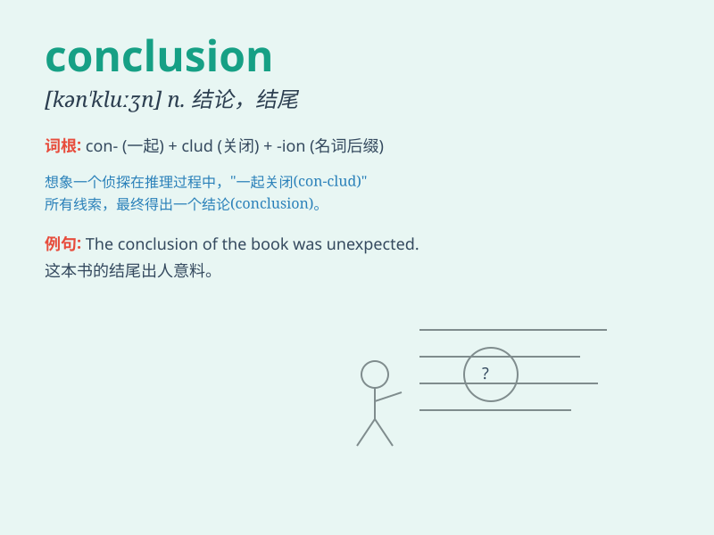

## conclusion

**英音:** _[kən\'kluːʒ(ə)n]_ **美音:** _[kən\'kluʒn]_

**译义:** *n.结束,缔结,结论*

### 短语

+ **draw a conclusion:** _得出结论_

+ **reach a conclusion:** _达成结论_

+ **come to a conclusion:** _得出结论_

+ **in conclusion:** _总之；最后_

+ **jump to a conclusion:** _匆忙下结论_

### 例句

#### 例句1

> **In conclusion, I would like to thank everyone for their
support.**

**中文翻译:** 最后，我要感谢大家的支持。

**单词释义:** 总之；最后

#### 例句2

> **We came to the conclusion that the plan was not feasible.**

**中文翻译:** 我们得出的结论是该计划不可行。

**单词释义:** 结论

#### 例句3

> **The conclusion of the story was very touching.**

**中文翻译:** 故事的结局非常感人。

**单词释义:** 结局；结尾

### 背诵小故事

> A detective spent days investigating a mystery. After gathering all
the clues and thinking hard, he finally reached a conclusion. It was
like finding the last piece of a puzzle and solving the case.

**一位侦探花了好多天调查一个谜团。在收集了所有线索并苦思冥想后，他终于得出了结论。这就像找到了拼图的最后一块并解决了案件。**

### 图义

