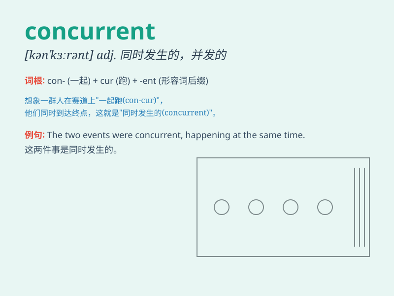

## concurrent

**英音:** _[kən\'kʌr(ə)nt]_ **美音:** _[kən\'kɝənt]_

**译义:** *n.同时发生的事件adj.并发的,协作的,一致的*

### 短语

+ **concurrent processing:** _并行处理_

+ **concurrent lines:** _并行线_

+ **concurrent jurisdiction:** _共同管辖权_

+ **concurrent session:** _同时举行的会议_

+ **concurrent events:** _同时发生的事件_

### 例句

#### 例句1

> **The concurrent events caused confusion among the attendees.**

**中文翻译:** 同时发生的事件引起与会者的混乱。

**单词释义:** 同时发生的

#### 例句2

> **He was serving two concurrent prison sentences.**

**中文翻译:** 他同时服刑两次。

**单词释义:** 同期的

#### 例句3

> **The software can handle concurrent users without any performance
degradation.**

**中文翻译:** 该软件可以处理并发用户，而不会降低性能。

**单词释义:** 并发的

### 背诵小故事

>
想象一下，在一场盛大的音乐会中，歌手在舞台上唱歌，同时乐队在演奏，观众在欢呼，这三种活动同时发生（concurrent），共同营造出了热烈的氛围。

**想象在音乐会中，歌手唱歌、乐队演奏、观众欢呼同时发生，来记住
concurrent 表示同时发生的意思**

### 图义

