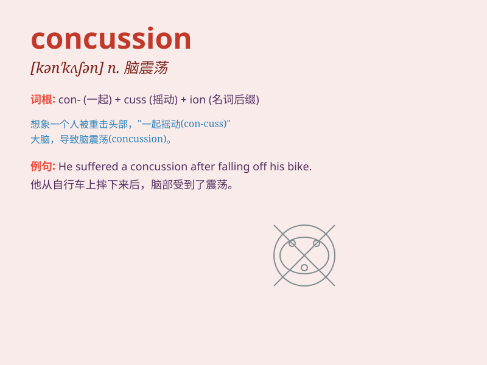

## concussion

**英音:** _[kən\'kʌʃ(ə)n]_ **美音:** _[kən\'kʌʃən]_

**译义:** *n.激动,冲击,[医]震荡*

### 短语

+ **cerebral concussion:** _脑震荡_

+ **minor concussion:** _轻度脑震荡_

+ **suffer a concussion:** _遭受脑震荡_

+ **concussion injury:** _脑震荡损伤_

+ **post-concussion syndrome:** _脑震荡后综合征_

### 例句

#### 例句1

> **He suffered a concussion after the car accident.**

**中文翻译:** 车祸后他遭受了脑震荡。

**单词释义:** 脑震荡

#### 例句2

> **The athlete was sidelined due to a concussion.**

**中文翻译:** 该运动员因脑震荡而缺席。

**单词释义:** 脑震荡

#### 例句3

> **A severe concussion can have long-term effects on one\'s
health.**

**中文翻译:** 严重脑震荡会对人的健康产生长期影响。

**单词释义:** 脑震荡

### 背诵小故事

> One day, Tom was playing football. He got hit hard on the head and
felt dizzy. The doctor said it was a concussion. Poor Tom needed to rest
to recover. Remember, a concussion is a brain injury!

**有一天，汤姆在踢足球。他的头被重重地撞了一下，感到头晕。医生说这是脑震荡。可怜的汤姆需要休息来恢复。记住，concussion
就是脑震荡！**

### 图义

