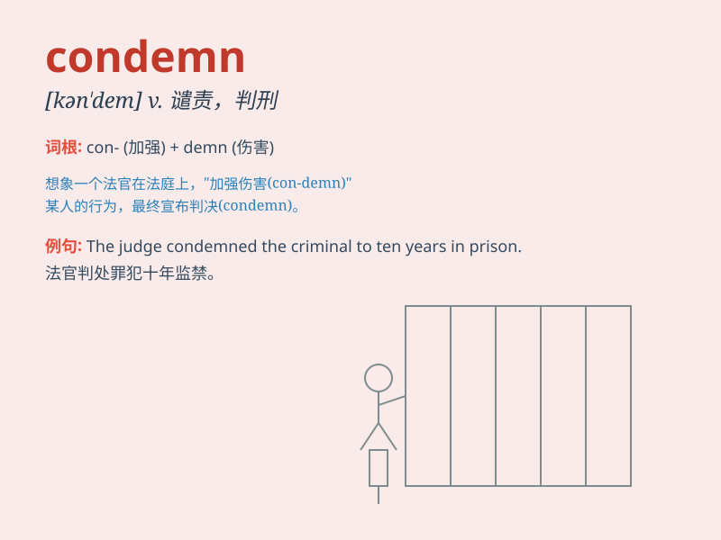

## condemn

**英音:** _[kən\'dem]_ **美音:** _[kən\'dɛm]_

**译义:** *vt.判刑,处刑,声讨,谴责*

### 短语

+ **condemn sb to sth:** _迫使某人接受困境（或不愉快的状况）_

+ **condemn sth as sth:** _指责某事物为..._

+ **be condemned to do sth:** _注定要做某事_

+ **condemn sb for sth:** _因某事谴责某人_

+ **strongly condemn:** _强烈谴责_

### 例句

#### 例句1

> **The judge condemned the criminal to life imprisonment.**

**中文翻译:** 法官判处罪犯终身监禁。

**单词释义:** 判处，定罪

#### 例句2

> **We condemn all forms of violence.**

**中文翻译:** 我们谴责一切形式的暴力。

**单词释义:** 谴责，指责

#### 例句3

> **The old building was condemned as unsafe.**

**中文翻译:** 这座老建筑被谴责为不安全。

**单词释义:** 宣告（建筑物）不宜使用

### 背诵小故事

> A thief was caught stealing. The judge condemned him to prison.
Everyone said it was fair because his actions were wrong. Condemn means
to express strong disapproval and punish.

**一个小偷行窃被抓。法官判他入狱。大家都说这很公平，因为他的行为是错误的。condemn
意思是强烈谴责并给予惩罚。**

### 图义

