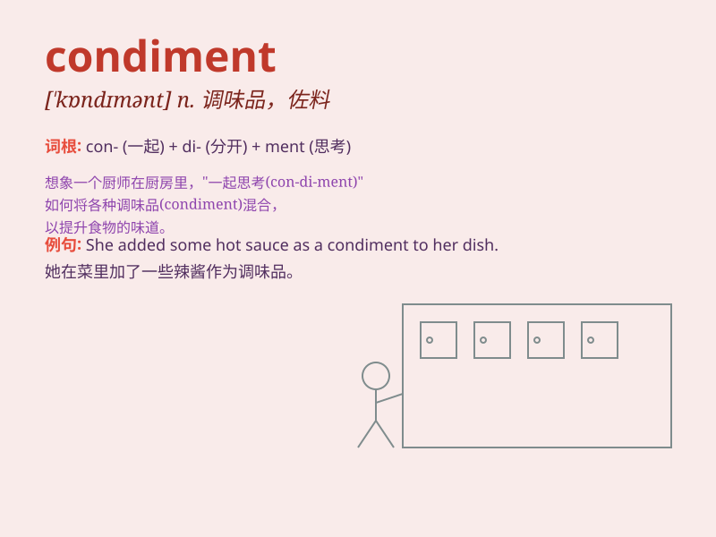

## condiment

**英音:** _[\'kɒndɪm(ə)nt]_ **美音:** _[\'kɑndɪmənt]_

**译义:** *n.调味品*

### 短语

+ **spicy condiment:** _辛辣的调味料_

+ **common condiment:** _常见的调味料_

+ **exotic condiment:** _异国风味的调味料_

+ **salty condiment:** _咸的调味料_

+ **sweet condiment:** _甜的调味料_

### 例句

#### 例句1

> **I added some condiments to the salad to enhance the flavor.**

**中文翻译:** 我在沙拉里加了一些调味品来增强味道。

**单词释义:** 调味料

#### 例句2

> **The chef carefully selected the condiments for the special
dish.**

**中文翻译:** 厨师为这道特色菜精心挑选了调味品。

**单词释义:** 调味料

#### 例句3

> **The table was set with various condiments for the guests to
use.**

**中文翻译:** 桌子上摆满了各种调味品供客人使用。

**单词释义:** 调味料

### 背诵小故事

> Once upon a time, a chef was preparing a delicious meal. But the
taste was lacking. Then he remembered the condiments! He added salt,
pepper, and various spices. The meal became wonderful. Condiments made
all the difference!

**从前，有位厨师在准备一顿美味的饭菜。但味道有所欠缺。然后他想起了调味料！他加了盐、胡椒和各种香料。这顿饭变得很棒。调味料起了关键作用！**

### 图义

