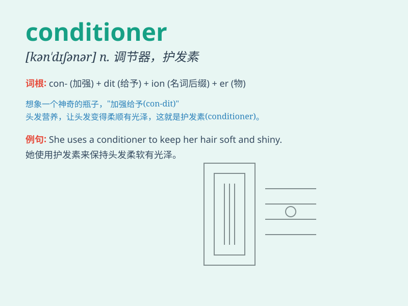

## conditioner

**英音:** _[kən\'dɪʃ(ə)nə]_ **美音:** _[kən\'dɪʃənɚ]_

**译义:** *n.调节者,调节装置*

### 短语

+ **air conditioner:** _空调_

+ **hair conditioner:** _护发素_

+ **conditioner treatment:** _调理护理_

+ **skin conditioner:** _护肤调理剂_

+ **fabric conditioner:** _织物柔顺剂_

### 例句

#### 例句1

> **I need to buy a new hair conditioner.**

**中文翻译:** 我需要买一个新的护发素。

**单词释义:** 护发素

#### 例句2

> **The air conditioner in the room is not working properly.**

**中文翻译:** 房间里的空调不能正常工作。

**单词释义:** 空调

#### 例句3

> **This fabric conditioner makes the clothes softer.**

**中文翻译:** 这种织物调理剂可以使衣服变得更加柔软。

**单词释义:** 织物柔顺剂

### 背诵小故事

> One hot summer day, I was sweating a lot. Then I used a conditioner
to make my hair smooth and shiny. It was like a magic potion that fixed
my hair\'s condition and made me feel fresh and confident.

**在一个炎热的夏日，我汗流浃背。然后我使用了护发素，让我的头发变得顺滑有光泽。它就像一瓶神奇的药水，改善了我头发的状况，让我感到清新自信。**

### 图义

