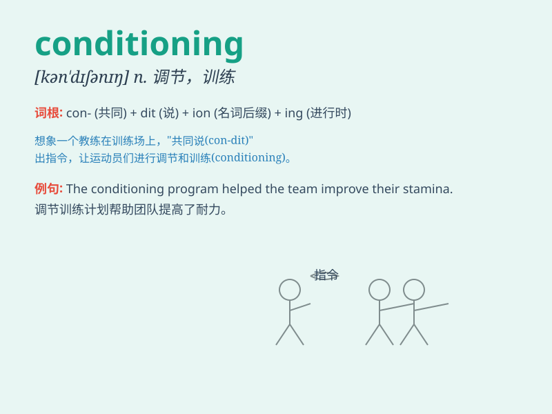

## conditioning

**英音:** _[kən\'dɪʃənɪŋ]_ **美音:** _[kən\'dɪʃənɪŋ]_

**译义:** *n.[心]条件作用,训练*

### 短语

+ **air conditioning:** _空调；空气调节_

+ **conditioning exercise:** _适应性训练_

+ **conditioning treatment:** _调理护理_

+ **behavior conditioning:** _行为条件作用_

+ **thermal conditioning:** _热调节；热工况_

### 例句

#### 例句1

> **The athlete\'s excellent performance is the result of rigorous
conditioning.**

**中文翻译:** 运动员的优异成绩是严格训练的结果。

**单词释义:** 训练；锻炼

#### 例句2

> **Air conditioning is a must in this hot summer.**

**中文翻译:** 在这个炎热的夏天，空调是必备的。

**单词释义:** 空调系统；调节

#### 例句3

> **The conditioning of the soil is important for plant growth.**

**中文翻译:** 土壤的调理对于植物生长很重要。

**单词释义:** 状况；状态

### 背诵小故事

> A young athlete was constantly training in the hot sun. This
repetitive process of training was called conditioning. It made him
stronger and better prepared for competitions.

**一位年轻的运动员一直在烈日下不断训练。这种重复的训练过程被称为条件作用。这使他更强壮，为比赛做了更好的准备。**

### 图义

