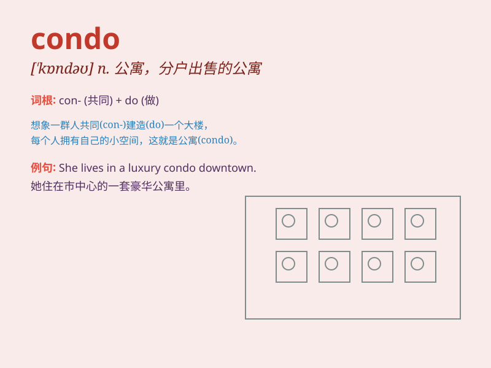

## condo

**英音:** _[\'kɒndəʊ]_ **美音:** _[\'kɑndo]_

**译义:** * condominium 分户出售公寓大厦*

### 短语

+ **condo complex:** _公寓大楼群_

+ **luxury condo:** _豪华公寓_

+ **beach condo:** _海滨公寓_

+ **condo association:** _公寓协会_

+ **condo rental:** _公寓出租_

### 例句

#### 例句1

> **I bought a condo near the beach for vacations.**

**中文翻译:** 我在海滩附近买了一套公寓来度假。

**单词释义:** 公寓

#### 例句2

> **The condo has a beautiful view of the city.**

**中文翻译:** 公寓享有城市的美丽景色。

**单词释义:** 公寓

#### 例句3

> **They are renting a condo while looking for a house to buy.**

**中文翻译:** 他们一边租一套公寓，一边寻找可买的房子。

**单词释义:** 公寓

### 背诵小故事

> A young couple was looking for a new home. They finally found a nice
condo. It had a beautiful view and was close to their work. They were so
happy to call this condo their own.

**一对年轻夫妇正在寻找新家。他们最终找到了一个不错的公寓。它有美丽的景色，而且离他们工作的地方很近。他们非常高兴能拥有这个公寓。**

### 图义

