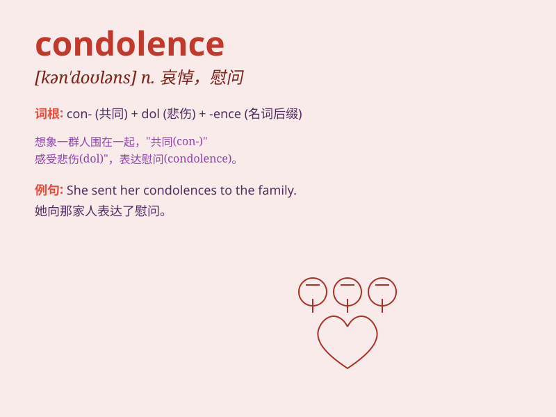

## condolence

**英音:** _[kən\'dəʊl(ə)ns]_ **美音:** _[kən\'doləns]_

**译义:** *n.哀悼,吊唁*

### 短语

+ **express condolence:** _表示哀悼_

+ **offer condolence:** _致以慰问_

+ **deep condolence:** _深切的哀悼_

+ **sincere condolence:** _诚挚的哀悼_

+ **receive condolence:** _接受哀悼_

### 例句

#### 例句1

> **I expressed my condolence to him on the loss of his father.**

**中文翻译:** 我就他父亲的去世向他表示哀悼。

**单词释义:** 哀悼；慰问

#### 例句2

> **Please accept my sincere condolence for your mother\'s
passing.**

**中文翻译:** 请接受我对你母亲去世的诚挚哀悼。

**单词释义:** 哀悼；吊唁

#### 例句3

> **She received many letters of condolence after her husband\'s
death.**

**中文翻译:** 丈夫去世后，她收到了多封吊唁信。

**单词释义:** 慰问；哀悼之情

### 背诵小故事

> One day, when Tom lost his dear pet dog, his friends came to express
their condolence. They said kind words and gave him hugs, showing their
sympathy and comfort.

**一天，当汤姆失去了他亲爱的宠物狗时，他的朋友们前来表示哀悼。他们说了亲切的话并给他拥抱，展现出他们的同情和安慰。**

### 图义

