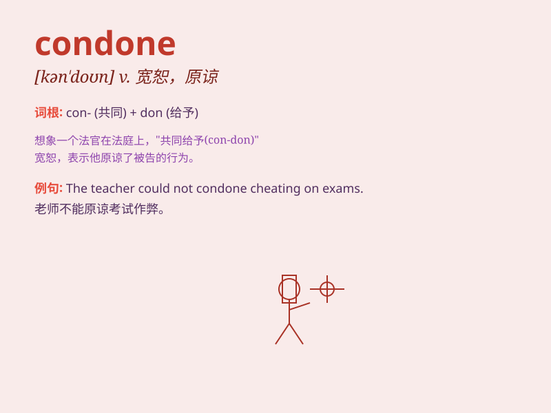

## condone

**英音:** _[kən\'dəʊn]_ **美音:** _[kən\'don]_

**译义:** *vt.宽恕,赦免*

### 短语

+ **condone violence:** _宽恕暴力_

+ **condone an error:** _原谅错误_

+ **condone bad behavior:** _容忍不良行为_

+ **condone immoral acts:** _宽恕不道德的行为_

+ **condone illegal activities:** _纵容非法活动_

### 例句

#### 例句1

> **We cannot condone violence of any kind.**

**中文翻译:** 我们不能纵容任何形式的暴力。

**单词释义:** 容忍；宽恕

#### 例句2

> **His parents condoned his bad behavior.**

**中文翻译:** 他的父母纵容了他的不良行为。

**单词释义:** 纵容；默许

#### 例句3

> **Society should not condone illegal activities.**

**中文翻译:** 社会不应纵容违法行为。

**单词释义:** 宽恕；原谅

### 背诵小故事

> A king condoned the mistakes of his subjects when they showed true
repentance. He understood that everyone makes errors and giving a second
chance can lead to better outcomes.

**一位国王在他的臣民真心忏悔时宽恕了他们的过错。他明白每个人都会犯错，给予第二次机会可能会带来更好的结果。**

### 图义

