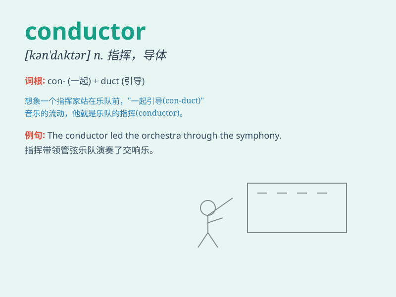

## conductor

**英音:** _[kən\'dʌktə]_ **美音:** _[kən\'dʌktɚ]_

**译义:**
*n.领导者,经理,指挥管弦乐队、合唱队的,(市内有轨电车或公共汽车)售票员,\<美>列车长*

### 短语

+ **bus conductor:** _公共汽车售票员_

+ **conductor rail:** _导电轨_

+ **orchestra conductor:** _管弦乐队指挥_

+ **electric conductor:** _电导体_

+ **heat conductor:** _热导体_

### 例句

#### 例句1

> **The conductor of the orchestra raised his baton and the music
began.**

**中文翻译:** 乐团指挥举起指挥棒，音乐开始了。

**单词释义:** 指挥（乐团、乐队等的）人

#### 例句2

> **The bus conductor collected the fares from the passengers.**

**中文翻译:** 公交车售票员向乘客收取车费。

**单词释义:** （公共交通工具的）售票员

#### 例句3

> **Copper is a good conductor of electricity.**

**中文翻译:** 铜是良好的电导体。

**单词释义:** 导体；导电体

### 背诵小故事

>
想象一下，在一辆拥挤的公交车上，司机掌控着方向盘，引导着车辆前行。这位司机就像一个
conductor，他指挥着车辆，确保每位乘客的安全和顺利出行。

**想象在公交车上，司机就像一个'指挥者'，掌控并引导车辆，这里的指挥者就是单词'conductor'，有指挥者、导体的意思**

### 图义

