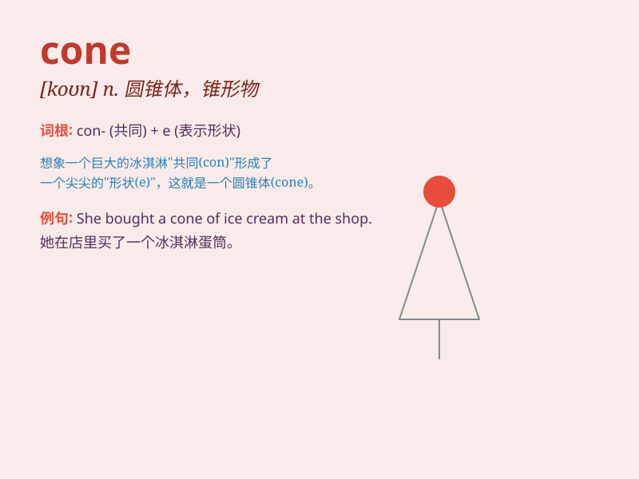

## cone

**英音:** _[kəʊn]_ **美音:** _[kon]_

**译义:** *n.[数、物]锥形物,圆锥体,(松树的)球果vt.使成锥形*

### 短语

+ **ice cream cone:** _冰淇淋甜筒_

+ **traffic cone:** _交通锥_

+ **cone shape:** _圆锥形状_

+ **pine cone:** _松果_

+ **cone crusher:** _圆锥破碎机_

### 例句

#### 例句1

> **The ice cream was served in a sugar cone.**

**中文翻译:** 冰淇淋装在一个甜筒里。

**单词释义:** 圆锥体；甜筒

#### 例句2

> **The traffic cone was placed on the road to indicate
construction.**

**中文翻译:** 道路上放置了交通锥以指示施工。

**单词释义:** 圆锥体；路锥

#### 例句3

> **The pine cone lay on the ground.**

**中文翻译:** 松果躺在地上。

**单词释义:** 松果

### 背诵小故事

> A little bear was lost in the forest. It saw a big pine tree and
found a cone under it. The cone was so special that the bear remembered
the way home by it. The cone became its guide.

**一只小熊在森林里迷路了。它看到一棵大松树，在树下发现了一个圆锥体。这个圆锥体很特别，小熊凭借它记住了回家的路。这个圆锥体成了它的向导。**

### 图义

