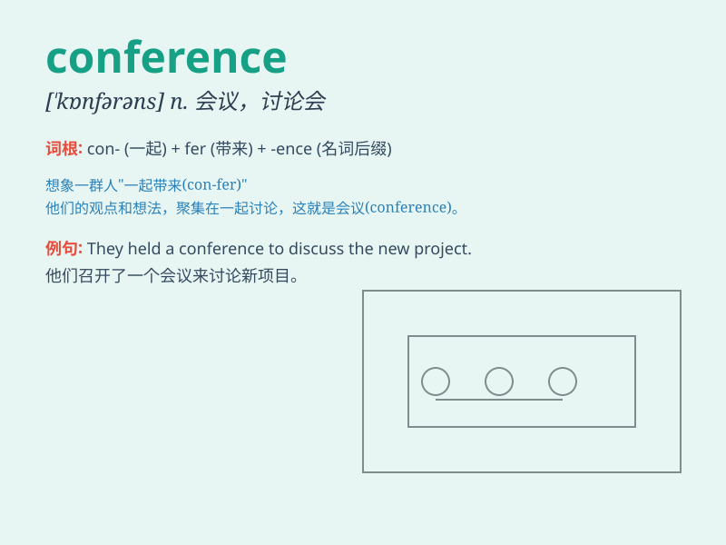

## conference

**英音:** _[\'kɒnf(ə)r(ə)ns]_ **美音:** _[\'kɑnfərəns]_

**译义:** *n.会议,讨论会,协商会*

### 短语

+ **international conference:** _国际会议_

+ **conference room:** _会议室_

+ **press conference:** _新闻发布会_

+ **video conference:** _视频会议_

+ **summit conference:** _首脑会议_

### 例句

#### 例句1

> **The international conference on climate change attracted experts
from around the world.**

**中文翻译:** 气候变化国际会议吸引了来自世界各地的专家。

**单词释义:** 会议

#### 例句2

> **They are preparing for the sales conference next week.**

**中文翻译:** 他们正在为下周的销售会议做准备。

**单词释义:** 会议

#### 例句3

> **The conference room is fully equipped with modern facilities.**

**中文翻译:** 会议室配备齐全的现代化设施。

**单词释义:** 会议室

### 背诵小故事

> A group of smart people gathered for a conference. They sat around a
big table, sharing ideas and solving problems. It was like a big brain
party, full of discussions and decisions.

**一群聪明的人聚在一起开了个会议。他们围坐在一张大桌子旁，分享想法并解决问题。这就像一场盛大的头脑派对，充满了讨论和决策。**

### 图义

