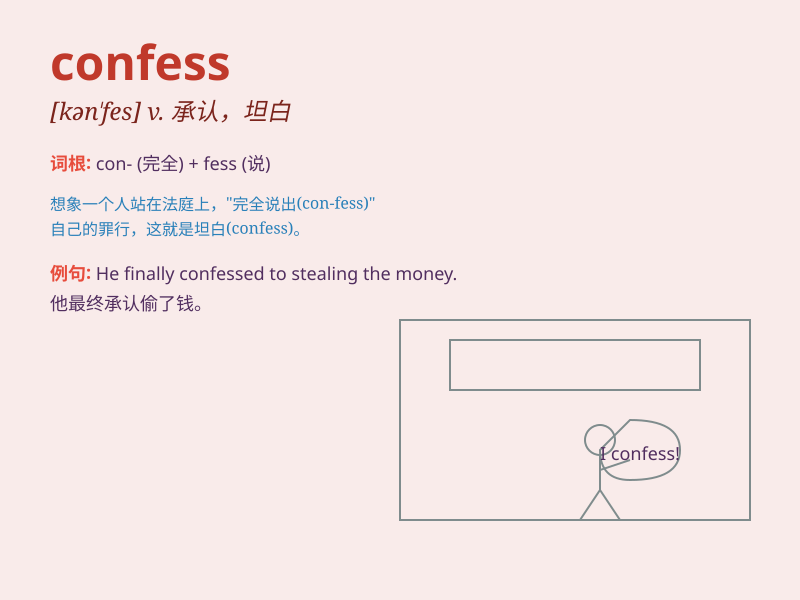

## confess

**英音:** _[kən\'fes]_ **美音:** _[kən\'fɛs]_

**译义:** *v.承认,坦白,忏悔*

### 短语

+ **confess to:** _承认；供认_

+ **confess one\'s crime:** _坦白罪行_

+ **confess one\'s fault:** _承认错误_

+ **confess love:** _表白爱意_

+ **confess sincerely:** _真诚地坦白_

### 例句

#### 例句1

> **He confessed his crime to the police.**

**中文翻译:** 他向警方承认了自己的罪行。

**单词释义:** 坦白；承认

#### 例句2

> **She finally confessed that she had stolen the money.**

**中文翻译:** 她最终承认自己偷了钱。

**单词释义:** 承认；供认

#### 例句3

> **The priest encouraged the sinner to confess.**

**中文翻译:** 神父鼓励罪人认罪。

**单词释义:** 忏悔

### 背诵小故事

> A thief was caught and finally confessed to stealing the jewels. He
felt so guilty and decided to tell the truth. \'Confess\' means to admit
or own up to something, especially something wrong or embarrassing.

**一个小偷被抓住了，最终承认偷了珠宝。他感到非常内疚，决定说出真相。'confess'这个单词意思是承认，尤指承认错误或令人尴尬的事。**

### 图义

