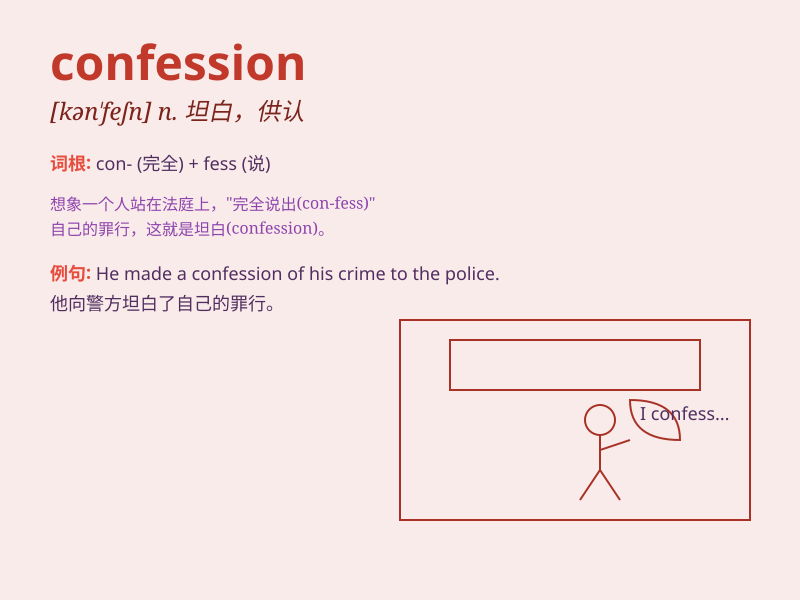

## confession

**英音:** _[kən\'feʃ(ə)n]_ **美音:** _[kən\'fɛʃən]_

**译义:** *n.供认,承认,招供*

### 短语

+ **make a confession:** _招供；坦白_

+ **confession of guilt:** _认罪_

+ **forced confession:** _逼供；强迫招供_

+ **voluntary confession:** _自愿供认_

+ **extract a confession:** _逼取口供_

### 例句

#### 例句1

> **His confession shocked everyone in the room.**

**中文翻译:** 他的坦白震惊了房间里的所有人。

**单词释义:** 供认；坦白

#### 例句2

> **The priest listened to her confession of sins.**

**中文翻译:** 神父听她认罪。

**单词释义:** 忏悔

#### 例句3

> **The thief made a full confession after being caught.**

**中文翻译:** 小偷被抓后供认不讳。

**单词释义:** 坦白

### 背诵小故事

> One day, a thief was caught and made a confession. He admitted to
stealing many valuable things. The police were relieved as his
confession helped solve the case.

**有一天，一个小偷被抓住了并作出了坦白。他承认偷了很多贵重的东西。警察感到欣慰，因为他的供认有助于破案。**

### 图义

