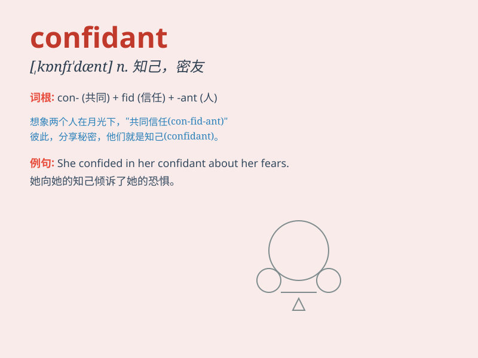

## confidant

**英音:** _[\'kɒnfɪdænt; ,kɒnfɪ\'dænt; -dɑːnt]_ **美音:**
_[\'kɑnfɪdænt]_

**译义:** *n.心腹朋友,知己*

### 短语

+ **close confidant:** _亲密的知己_

+ **trusted confidant:** _值得信赖的知己_

+ **female confidant:** _红颜知己_

+ **male confidant:** _蓝颜知己_

+ **long-time confidant:** _长期的知己_

### 例句

#### 例句1

> **He is my closest confidant and I tell him everything.**

**中文翻译:** 他是我最亲密的知己，我把一切都告诉他。

**单词释义:** 知己；密友

#### 例句2

> **She has no female confidant to share her secrets with.**

**中文翻译:** 她没有可以分享秘密的女性知己。

**单词释义:** 知己；密友

#### 例句3

> **The king\'s confidant advised him on important matters.**

**中文翻译:** 国王的心腹在重要事务上向他提出建议。

**单词释义:** 亲信

### 背诵小故事

> A king had a trusted friend who knew all his secrets. This friend was
the king\'s confidant. Whenever the king faced difficulties, he would
confide in his confidant. The confidant always listened carefully and
gave helpful advice.

**一位国王有一个值得信赖的朋友，知晓他所有的秘密。这个朋友就是国王的知己。每当国王遇到困难，他都会向他的知己倾诉。这位知己总是认真倾听并给出有用的建议。**

### 图义

