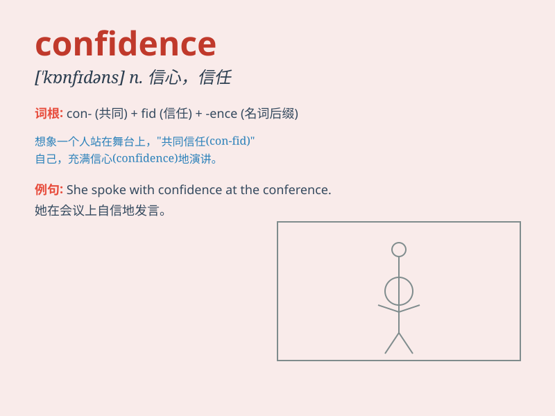

## confidence

**英音:** _[\'kɒnfɪd(ə)ns]_ **美音:** _[\'kɑnfɪdəns]_

**译义:** *n.信心*

### 短语

+ **confidence in:** _对\...\...的信任；对\...\...有信心_

+ **have confidence:** _有信心_

+ **build confidence:** _建立信心_

+ **lose confidence:** _失去信心_

+ **confidence interval:** _置信区间_

### 例句

#### 例句1

> **I have confidence in my ability to pass the exam.**

**中文翻译:** 我对自己通过考试的能力充满信心。

**单词释义:** 信心

#### 例句2

> **Her confidence grew as she gained more experience.**

**中文翻译:** 随着经验的积累，她的信心也随之增强。

**单词释义:** 自信心

#### 例句3

> **The team played with confidence and won the game easily.**

**中文翻译:** 球队打得充满信心，轻松赢得了比赛。

**单词释义:** 信心

### 背诵小故事

> One day, Tom was very nervous before the exam. But when he thought of
all the efforts he had made, he gained confidence. He believed he could
do well and finally got a high score.

**一天，汤姆在考试前非常紧张。但当他想到自己付出的所有努力，他获得了信心。他相信自己能做好，最终取得了高分。**

### 图义

