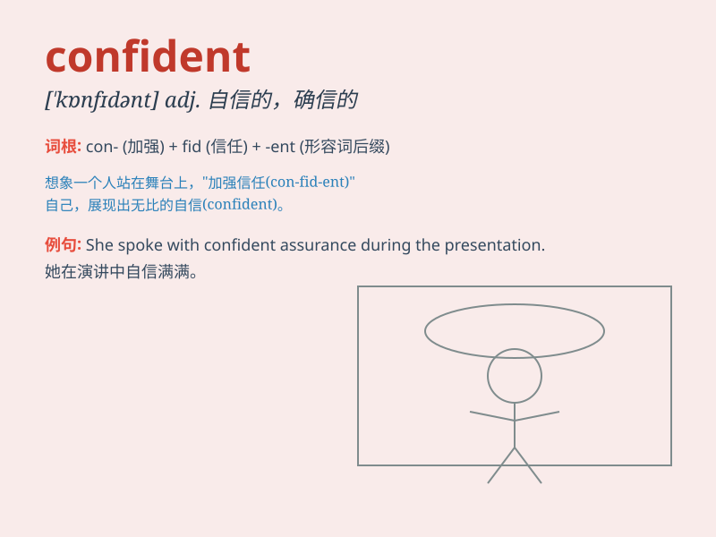

## confident

**英音:** _[\'kɒnfɪd(ə)nt]_ **美音:** _[\'kɑnfɪdənt]_

**译义:** *adj.自信的,确信的*

### 短语

+ **be confident of:** _对\...\...有信心_

+ **confident smile:** _自信的微笑_

+ **confident manner:** _自信的态度_

+ **become confident:** _变得自信_

+ **confident performance:** _自信的表现_

### 例句

#### 例句1

> **I\'m confident that I can pass the exam.**

**中文翻译:** 我有信心我能通过考试。

**单词释义:** 有信心的

#### 例句2

> **She is confident in her ability to solve the problem.**

**中文翻译:** 她对自己解决问题的能力充满信心。

**单词释义:** 自信的

#### 例句3

> **The team was confident of winning the championship.**

**中文翻译:** 球队对夺冠充满信心。

**单词释义:** 确信的

### 背诵小故事

> A young singer was very nervous before a big performance. But when
she thought of all her hard practice, she became confident. She sang
beautifully and won everyone\'s heart. Confident means feeling sure of
oneself and one\'s abilities.

**一位年轻的歌手在一场大型演出前非常紧张。但当她想到自己所有的刻苦练习时，她变得自信了。她唱得很动听，赢得了大家的心。Confident
意思是对自己和自身能力有把握、有信心。**

### 图义

