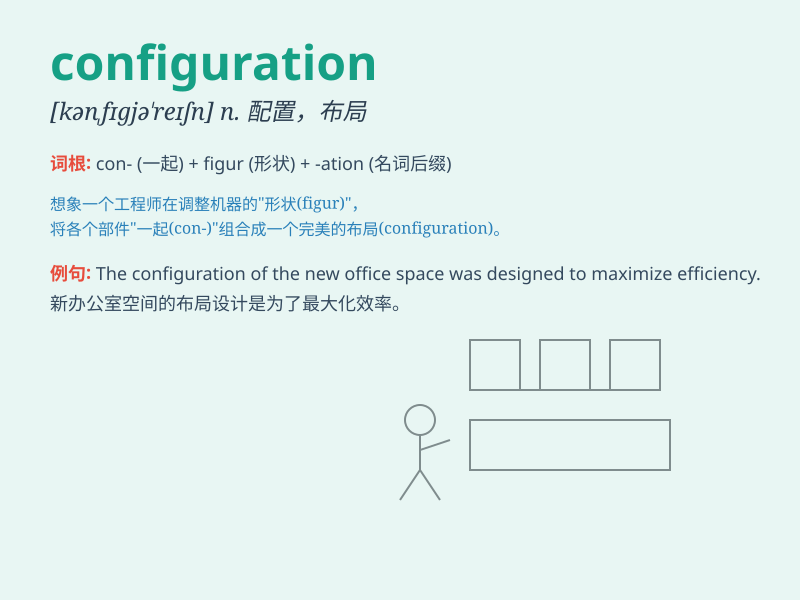

## configuration

**英音:** _[kən,fɪgə\'reɪʃ(ə)n; -gjʊ-]_ **美音:**
_[kən,fɪɡjə\'reʃən]_

**译义:** *n.构造,结构,配置,外形*

### 短语

+ **system configuration:** _系统配置_

+ **network configuration:** _网络配置_

+ **hardware configuration:** _硬件配置_

+ **software configuration:** _软件配置_

+ **default configuration:** _默认配置_

### 例句

#### 例句1

> **The configuration of the new office is very modern and
functional.**

**中文翻译:** 新办公室的配置非常现代且实用。

**单词释义:** 布局；构造

#### 例句2

> **The software requires a specific configuration to run
properly.**

**中文翻译:** 该软件需要特定配置才能正常运行。

**单词释义:** 配置；设定

#### 例句3

> **The configuration of the machine parts needs to be checked before
use.**

**中文翻译:** 使用前需要检查机器部件的配置。

**单词释义:** 配置；组合

### 背诵小故事

> 想象一个机器人，它的身体各部分的组装和排列方式就是它的
configuration。就像我们组装家具，每个零件的位置和组合决定了最终的样子，这就是
configuration 的意思。

**想象一个机器人，它身体各部分的组装和排列方式就是"配置；结构；布局"的意思。就像组装家具，零件的位置和组合决定最终形态，这就是"configuration"。**

### 图义

