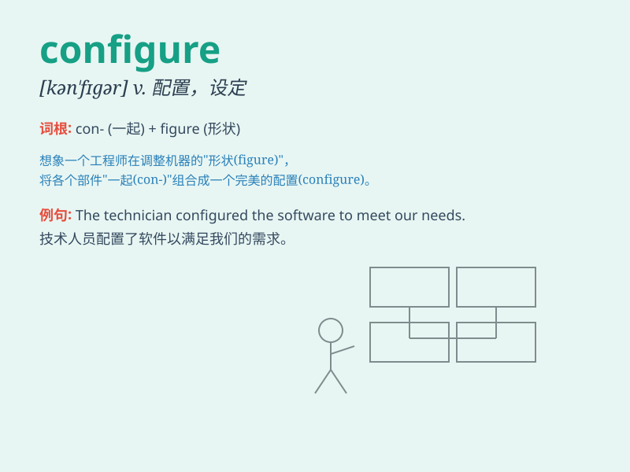

## configure

**英音:** _[kən\'fɪgə]_ **美音:** _[kən\'fɪɡjɚ]_

**译义:** *vi.配置,设定vt.使成形,使具一定形式*

### 短语

+ **configure as:** _配置为_

+ **configure for:** _为\...配置_

+ **configure system:** _配置系统_

+ **configure settings:** _配置设置_

+ **configure network:** _配置网络_

### 例句

#### 例句1

> **The IT department is responsible for configuring the new computer
systems.**

**中文翻译:** IT部门负责配置新的计算机系统。

**单词释义:** 配置

#### 例句2

> **You can configure the settings of this software to suit your
needs.**

**中文翻译:** 您可以配置该软件的设置以满足您的需要。

**单词释义:** 配置

#### 例句3

> **The engineer spent hours configuring the machine to improve its
performance.**

**中文翻译:** 工程师花了数小时配置机器以提高其性能。

**单词释义:** 配置

### 背诵小故事

>
想象你有一个神奇的机器人，你需要'configure'（配置）它的各种功能，比如设定它的语言、行动速度和工作模式，只有精心配置，它才能按照你的期望出色工作。

**想象你有一个神奇的机器人，你需要'配置'它的各种功能，比如设定它的语言、行动速度和工作模式，只有精心配置，它才能按照你的期望出色工作。**

### 图义

