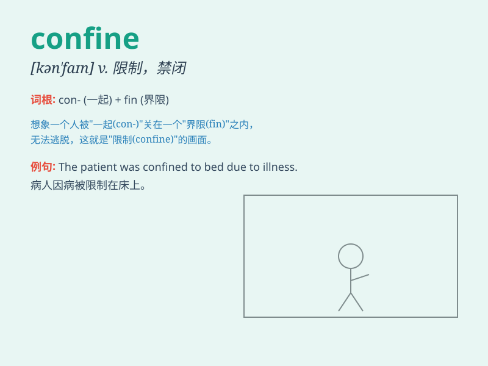

## confine

**英音:** _[kən\'faɪn]_ **美音:** _[kən\'faɪn]_

**译义:** *vt.限制,禁闭n.界限,边界*

### 短语

+ **confine oneself to:** _把自己限制在......范围内_

+ **be confined to bed:** _卧病在床_

+ **confine within:** _限制在......内_

+ **confine sth. to a place:** _把某物限制在某地_

+ **strict confine:** _严格限制_

### 例句

#### 例句1

> **The patient was confined to bed for weeks.**

**中文翻译:** 病人卧床数周。

**单词释义:** 限制；使局限

#### 例句2

> **The thief was confined in prison.**

**中文翻译:** 小偷被关进了监狱。

**单词释义:** 监禁；禁闭

#### 例句3

> **Please confine your remarks to the topic at hand.**

**中文翻译:** 请将您的评论限制在当前的主题范围内。

**单词释义:** 限制；限定

### 背诵小故事

> A little bird was injured and confined to a small cage. It longed to
fly freely again. \'Confine\' means to keep within limits or restrict.
So, like the bird, when something is confined, it\'s trapped or limited.

**一只小鸟受伤了，被限制在一个小笼子里。它渴望再次自由飞翔。\'confine\'意思是限制在一定范围内或加以约束。所以，就像这只鸟一样，当某物被confine时，它就被困住或受到限制了。**

### 图义

