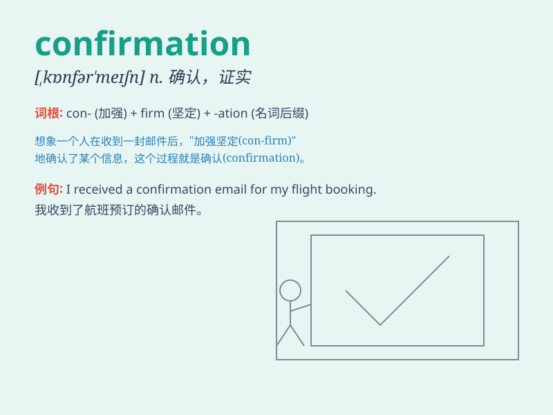

## confirmation

**英音:** _[kɒnfə\'meɪʃ(ə)n]_ **美音:**
_[,kɑnfɚ\'meʃən]_

**译义:** *n.证实,确认,批准*

### 短语

+ **confirmation bias:** _确认偏误_

+ **confirmation letter:** _确认函_

+ **confirmation hearing:** _确认听证会_

+ **confirmation of order:** _订单确认_

+ **confirmation message:** _确认消息_

### 例句

#### 例句1

> **I\'m still waiting for confirmation of the reservation.**

**中文翻译:** 我仍在等待预订确认。

**单词释义:** 确认；证实

#### 例句2

> **The confirmation of the contract was delayed.**

**中文翻译:** 合同的确认被推迟。

**单词释义:** 确认；认可

#### 例句3

> **We need written confirmation of your acceptance.**

**中文翻译:** 我们需要您的接受书面确认。

**单词释义:** 确认；确定

### 背诵小故事

> A detective was waiting for the confirmation of a suspect\'s
identity. Finally, he got the call - it was a definite confirmation.
With this, he could move forward with the case.

**一位侦探一直在等待嫌疑人身份的确认。最后，他接到了电话------这是一个明确的确认。有了这个，他可以推进案件了。**

### 图义

