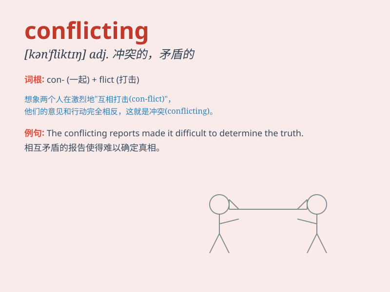

## conflicting

**英音:** _[kən\'flɪktɪŋ]_ **美音:** _[kən\'flɪktɪŋ]_

**译义:** *adj.相冲突的,不一致的,相矛盾的*

### 短语

+ **conflicting emotions:** _相互冲突的情绪_

+ **conflicting interests:** _利益冲突_

+ **conflicting reports:** _相互矛盾的报告_

+ **conflicting opinions:** _相互对立的意见_

+ **conflicting demands:** _相互冲突的要求_

### 例句

#### 例句1

> **The reports presented conflicting information about the
incident.**

**中文翻译:** 这些报告提供了有关该事件的相互矛盾的信息。

**单词释义:** 相互矛盾的

#### 例句2

> **She has conflicting emotions about leaving her hometown.**

**中文翻译:** 对于离开家乡，她的心情很矛盾。

**单词释义:** 矛盾的

#### 例句3

> **The two witnesses gave conflicting accounts of what happened.**

**中文翻译:** 两名目击者对所发生的事情的描述相互矛盾。

**单词释义:** 相互冲突的

### 背诵小故事

> In a magical forest, two wizards had conflicting ideas on how to
protect it. One wanted to build a strong barrier, while the other
preferred using spells. Their conflicting views led to a big argument.

**在一个神奇的森林里，两个巫师对于如何保护它有相互冲突的想法。一个想建造强大的屏障，另一个则倾向于使用魔法。他们相互冲突的观点引发了一场大争论。**

### 图义

