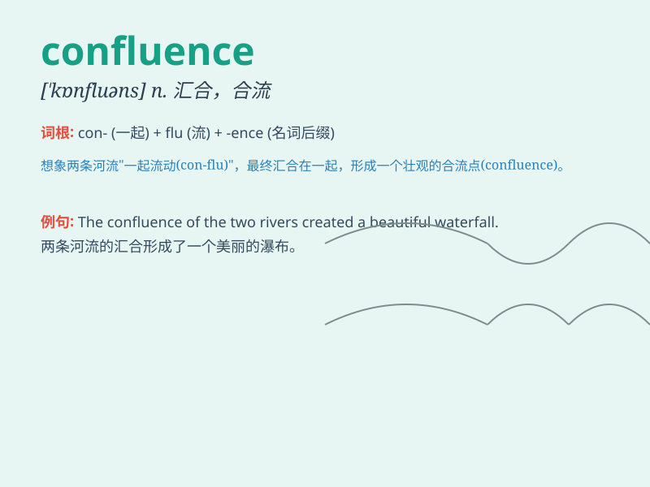

## confluence

**英音:** _[\'kɒnflʊəns]_ **美音:** _[\'kɑnfluəns]_

**译义:** *n.汇合*

### 短语

+ **confluence of rivers:** _河流的汇流处_

+ **confluence of events:** _事件的汇集_

+ **confluence of ideas:** _思想的汇聚_

+ **confluence of cultures:** _文化的融合_

+ **confluence of forces:** _力量的汇合_

### 例句

#### 例句1

> **The confluence of the two rivers creates a spectacular sight.**

**中文翻译:** 两条河流的交汇处形成了壮观的景象。

**单词释义:** 汇合；汇流

#### 例句2

> **There was a confluence of factors that led to the success of the
project.**

**中文翻译:** 该项目的成功是多种因素共同促成的。

**单词释义:** 汇集；汇聚

#### 例句3

> **The confluence of different cultures in the city makes it very
vibrant.**

**中文翻译:** 不同文化的交融使得这座城市充满活力。

**单词释义:** 融合；会聚

### 背诵小故事

>
想象一下，有两条清澈的小溪，它们一路流淌，最终在一个美丽的地方汇聚在一起，形成了一股更强大的水流。这个汇聚的地方就是\'confluence\'，代表着汇合、汇聚。

**想象两条小溪汇聚成一股水流来理解\'confluence\'这个表示汇合、汇聚的单词**

### 图义

