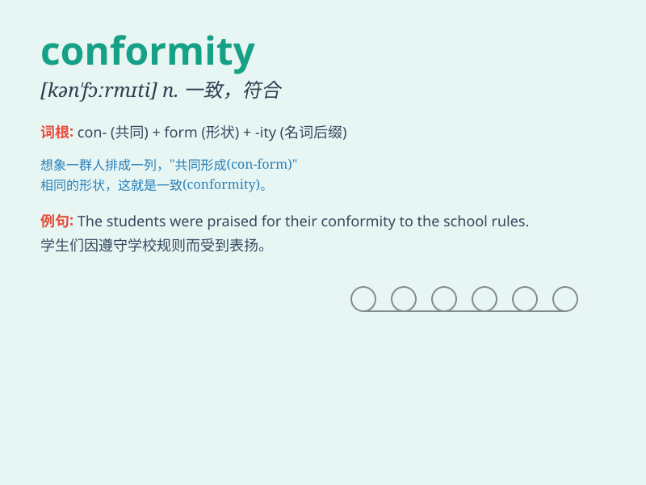

## conformity

**英音:** _[kən\'fɔːmɪtɪ]_ **美音:** _[kən\'fɔrməti]_

**译义:** *n.一致,符合*

### 短语

+ **in conformity with:** _与\...一致；符合_

+ **conformity assessment:** _合格评定；符合性评估_

+ **conformity certificate:** _合格证书_

+ **conformity inspection:** _合格检查；符合性检验_

+ **conformity to standards:** _符合标准_

### 例句

#### 例句1

> **The company demands strict conformity to its rules and
regulations.**

**中文翻译:** 公司要求严格遵守其规章制度。

**单词释义:** 遵守，符合

#### 例句2

> **She felt a sense of pressure to conform to the expectations of
her family.**

**中文翻译:** 她感到一种必须满足家人期望的压力。

**单词释义:** 符合，顺应

#### 例句3

> **Conformity in fashion often leads to a lack of individual
style.**

**中文翻译:** 追随时尚往往会导致缺乏个人风格。

**单词释义:** 从众，随大流

### 背诵小故事

> A young artist struggled with conformity. He was pressured to follow
the mainstream style, but in the end, he chose to stay true to his
unique vision. Conformity means compliance with established standards or
rules.

**一位年轻的艺术家在从众的问题上苦苦挣扎。他面临着遵循主流风格的压力，但最终选择坚守自己独特的视野。conformity
意思是遵守既定的标准或规则。**

### 图义

