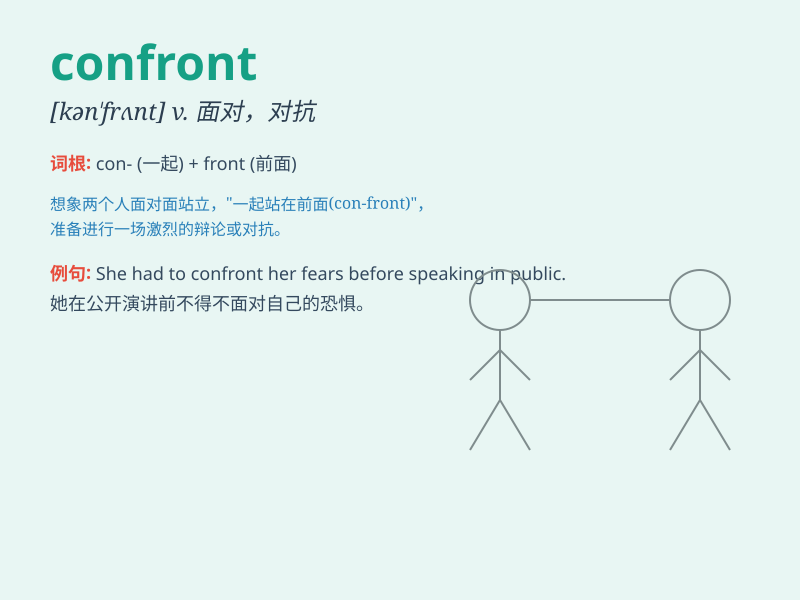

## confront

**英音:** _[kən\'frʌnt]_ **美音:** _[kən\'frʌnt]_

**译义:** *vt.使面临,对抗*

### 短语

+ **confront with:** _使面临；使面对_

+ **confront directly:** _直接面对_

+ **confront bravely:** _勇敢地面对_

+ **confront difficulties:** _面对困难_

+ **confront challenges:** _迎接挑战_

### 例句

#### 例句1

> **We must confront the problem head-on.**

**中文翻译:** 我们必须正视这个问题。

**单词释义:** 面对；正视

#### 例句2

> **He was confronted with a difficult choice.**

**中文翻译:** 他面临着一个艰难的选择。

**单词释义:** 使面临；遭遇

#### 例句3

> **The police confronted the thief in the street.**

**中文翻译:** 警察在街上与小偷对峙。

**单词释义:** 与\...\...对峙；对抗

### 背诵小故事

> A brave knight had to confront a fierce dragon. He gathered all his
courage, looked the dragon in the eyes, and prepared for the battle.
Confront means to face something difficult or dangerous directly.

**一位勇敢的骑士必须面对一只凶猛的龙。他鼓足勇气，直视龙的眼睛，准备战斗。confront
意思是直接面对困难或危险的事物。**

### 图义

