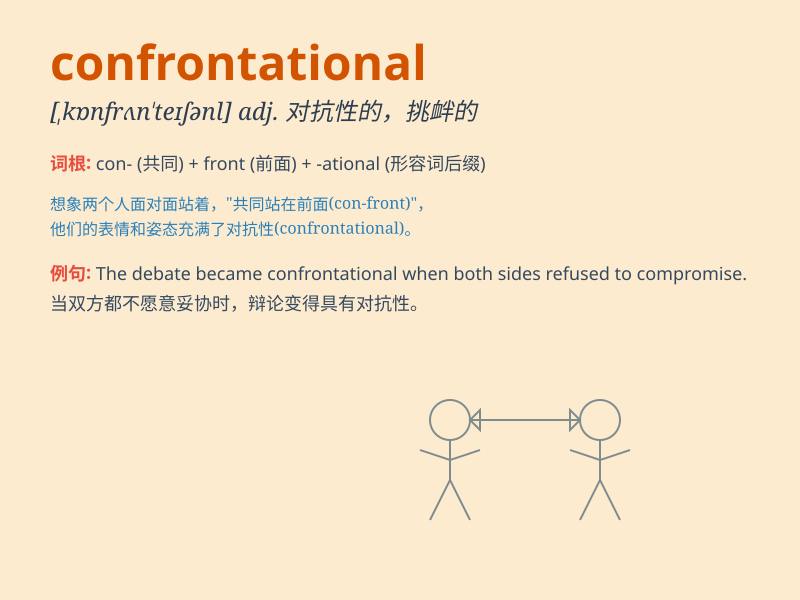

## confrontational

**英音:** _[ˌkɒnfrʌnˈteɪʃənl]_ **美音:**
_[ˌkɑːnfrʌnˈteɪʃənl]_

**译义:** *adj.对抗的；挑起冲突的*

### 短语

+ **confrontational attitude:** _对抗的态度_

+ **confrontational style:** _对抗的风格_

+ **confrontational behavior:** _对抗的行为_

+ **confrontational approach:** _对抗的方法_

+ **confrontational stance:** _对抗的立场_

### 例句

#### 例句1

> **His confrontational style often puts people on the defensive.**

**中文翻译:** 他这种对抗性的风格常常使人们处于防御状态。

**单词释义:** 对抗性的

#### 例句2

> **The confrontational approach is not always the best way to solve
problems.**

**中文翻译:** 这种对抗的方法并不总是解决问题的最佳方式。

**单词释义:** 对抗的

#### 例句3

> **She tried to avoid confrontational situations at work.**

**中文翻译:** 她试图避免工作中的对抗局面。

**单词释义:** 对抗的；冲突的

### 背诵小故事

> A brave knight was always confrontational. Whenever there was a
monster threatening the village, he would confront it without fear. His
confrontational spirit made him a hero.

**一位勇敢的骑士总是具有对抗性。每当有怪物威胁村庄时，他都会毫不畏惧地与之对抗。他的对抗精神使他成为了英雄。**

### 图义

