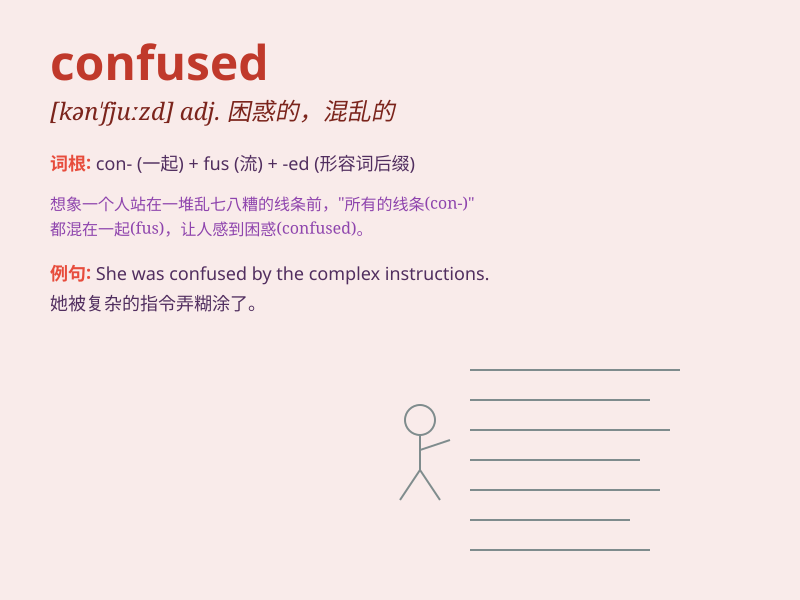

## confused

**英音:** _[kən\'fjuːzd]_ **美音:** _[kən\'fjuzd]_

**译义:** *adj.困惑的,烦恼的*

### 短语

+ **be confused about:** _对\...\...感到困惑_

+ **confused expression:** _困惑的表情_

+ **confused state:** _困惑的状态_

+ **feel confused:** _感到困惑_

+ **a confused mind:** _混乱的思绪_

### 例句

#### 例句1

> **I\'m confused about which way to go.**

**中文翻译:** 我很困惑该走哪条路。

**单词释义:** 感到困惑的

#### 例句2

> **His confused expression showed that he didn\'t understand.**

**中文翻译:** 他困惑的表情表明他不明白。

**单词释义:** 困惑的

#### 例句3

> **The instructions were so confusing that I got confused.**

**中文翻译:** 这些说明是如此令人困惑，以至于我感到困惑。

**单词释义:** 糊涂的；迷惑的

### 背诵小故事

> One day, Tom was in a big library. There were so many books and signs
that he got confused. He didn\'t know which section to go to find the
book he wanted. Poor Tom!

**一天，汤姆在一个大图书馆里。有太多的书和指示牌，以至于他感到困惑。他不知道该去哪个区域找他想要的书。可怜的汤姆！**

### 图义

