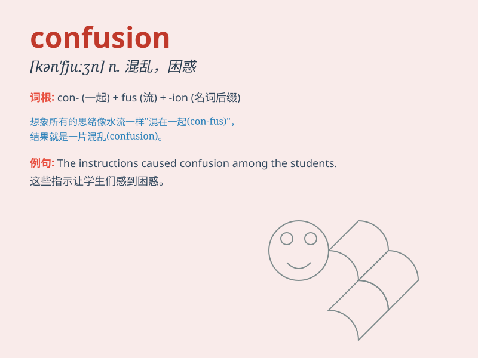

## confusion

**英音:** _[kən\'fjuːʒ(ə)n]_ **美音:** _[kən\'fjʊʒən]_

**译义:** *n.混乱,混淆*

### 短语

+ **in confusion:** _处于混乱状态_

+ **cause confusion:** _引起混乱_

+ **mental confusion:** _精神错乱_

+ **total confusion:** _完全混乱_

+ **confusion of ideas:** _思想混乱_

### 例句

#### 例句1

> **There was confusion among the students about the exam
schedule.**

**中文翻译:** 学生们对考试安排感到困惑。

**单词释义:** 困惑；混乱

#### 例句2

> **The confusion in the market led to a drop in stock prices.**

**中文翻译:** 市场的混乱导致股价下跌。

**单词释义:** 混乱

#### 例句3

> **His statement only added to the confusion.**

**中文翻译:** 他的言论只会加剧混乱。

**单词释义:** 混乱；困惑

### 背诵小故事

> A detective was solving a case, but there were so many clues that led
to different directions, causing great confusion. Finally, with careful
thinking, he sorted out the mess and found the truth.

**一位侦探在侦破一个案件，但有太多线索指向不同方向，造成了极大的混乱。最后，经过仔细思考，他理清了这团乱麻并找到了真相。**

### 图义

