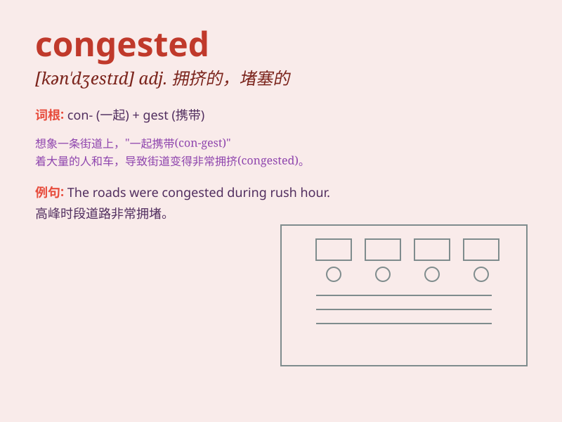

## congested

**英音:** _[kən\'dʒestɪd]_ **美音:** _[kən\'dʒɛstɪd]_

**译义:** *adj.拥挤的*

### 短语

+ **congested road:** _拥挤的道路_

+ **congested traffic:** _拥堵的交通_

+ **congested area:** _拥挤的区域_

+ **congested city:** _拥堵的城市_

+ **congested marketplace:** _拥挤的市场_

### 例句

#### 例句1

> **The roads in the city center are always congested during rush
hour.**

**中文翻译:** 市中心的道路在高峰时段总是拥堵。

**单词释义:** 拥堵的

#### 例句2

> **Her lungs were congested, making it difficult for her to
breathe.**

**中文翻译:** 她的肺部充血，呼吸困难。

**单词释义:** 充血的

#### 例句3

> **The airport was congested with passengers waiting for their
flights.**

**中文翻译:** 机场挤满了等待航班的乘客。

**单词释义:** 拥挤的

### 背诵小故事

> One day, I was stuck in a congested street. Cars were everywhere, and
the traffic moved very slowly. It was a chaotic scene. I realized
\'congested\' means crowded and blocked with too many things or people.

**有一天，我被困在一条拥堵的街道上。到处都是车，交通移动得非常缓慢。这是一个混乱的场景。我明白了'congested'意思是因太多的东西或人而拥挤、堵塞。**

### 图义

