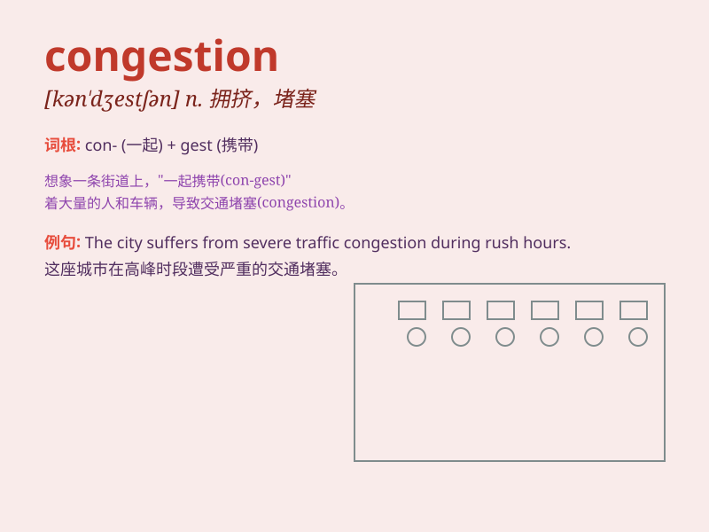

## congestion

**英音:** _[kən\'dʒestʃ(ə)n]_ **美音:**
_[kən\'dʒɛstʃən]_

**译义:** *n.拥塞,充血*

### 短语

+ **traffic congestion:** _交通拥堵_

+ **congestion charge:** _拥堵费_

+ **congestion control:** _拥塞控制_

+ **nasal congestion:** _鼻塞_

+ **lung congestion:** _肺充血_

### 例句

#### 例句1

> **The traffic congestion in the city is getting worse during rush
hours.**

**中文翻译:** 在高峰时段，城市的交通拥堵变得更加严重。

**单词释义:** 拥堵；阻塞

#### 例句2

> **There is a congestion in the nasal passages due to the cold.**

**中文翻译:** 由于寒冷，鼻腔出现充血现象。

**单词释义:** 堵塞；阻塞

#### 例句3

> **The port is experiencing congestion, causing delays in
shipping.**

**中文翻译:** 港口拥堵，导致航运延误。

**单词释义:** 拥堵；拥挤

### 背诵小故事

> One day, I was stuck in a traffic congestion on my way to work. Cars
were everywhere, and the road was completely blocked. I realized
\'congestion\' means a crowded and blocked situation.

**有一天，我在上班的路上遭遇了交通拥堵。到处都是车，道路完全被堵住了。我意识到\'congestion\'意思是拥挤堵塞的状况。**

### 图义

