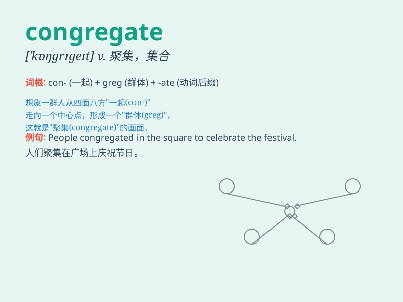

## congregate

**英音:** _[\'kɒŋgrɪgeɪt]_ **美音:** _[\'kɑŋɡrɪɡet]_

**译义:** *v.聚集*

### 短语

+ **congregate together:** _聚集在一起_

+ **congregate in large numbers:** _大量聚集_

+ **congregate at a place:** _在某地聚集_

+ **congregate for a purpose:** _为了某个目的聚集_

+ **congregate in groups:** _分组聚集_

### 例句

#### 例句1

> **People congregate in the park on Sundays to enjoy the
sunshine.**

**中文翻译:** 周日，人们聚集在公园里享受阳光。

**单词释义:** 聚集

#### 例句2

> **The birds congregate near the lake during winter.**

**中文翻译:** 冬天，鸟儿聚集在湖边。

**单词释义:** 聚集

#### 例句3

> **Students congregate in the cafeteria at lunchtime.**

**中文翻译:** 午餐时间，学生们聚集在自助餐厅。

**单词释义:** 聚集

### 背诵小故事

>
想象一下，有一群小鸟分散在各处。突然，一只聪明的鸟发出信号，所有小鸟都朝着一个大树聚集（congregate）过来。它们聚在一起叽叽喳喳，好不热闹。

**想象一群分散的小鸟因信号而聚集在一起的场景来记忆congregate（聚集、集合）这个单词**

### 图义

