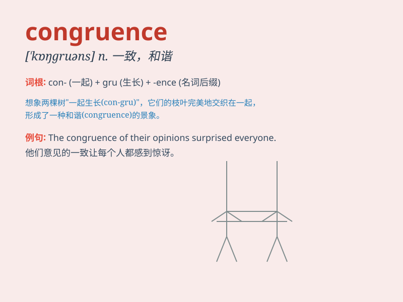

## congruence

**英音:** _[\'kɒŋgrʊəns]_ **美音:** _[\'kɑŋgrʊəns]_

**译义:** *n.适合,一致,叠合,全等,相合性*

### 短语

+ **congruence relation:** _同余关系_

+ **congruence modulo:** _模同余_

+ **geometric congruence:** _几何全等_

+ **congruence class:** _同余类_

+ **matrix congruence:** _矩阵同余_

### 例句

#### 例句1

> **There is a congruence between his words and actions.**

**中文翻译:** 他的言行一致。

**单词释义:** 一致；符合

#### 例句2

> **The congruence of the two triangles can be proved by the
side-angle-side rule.**

**中文翻译:** 两个三角形全等可以用边角边法则证明。

**单词释义:** 全等；一致性

#### 例句3

> **We need to ensure the congruence of the plan with our goals.**

**中文翻译:** 我们需要确保计划与我们的目标保持一致。

**单词释义:** 相符；一致

### 背诵小故事

> In a magical math land, there was a special key called
\'congruence\'. It was like a secret code that made two shapes or
numbers fit perfectly together. When we found this \'congruence\', it
was like solving a wonderful mystery.

**在一个神奇的数学王国里，有一把特殊的钥匙叫"全等"。它就像一个秘密代码，能让两个形状或数字完美地契合在一起。当我们找到这个"全等"，就像解开了一个奇妙的谜团。**

### 图义

