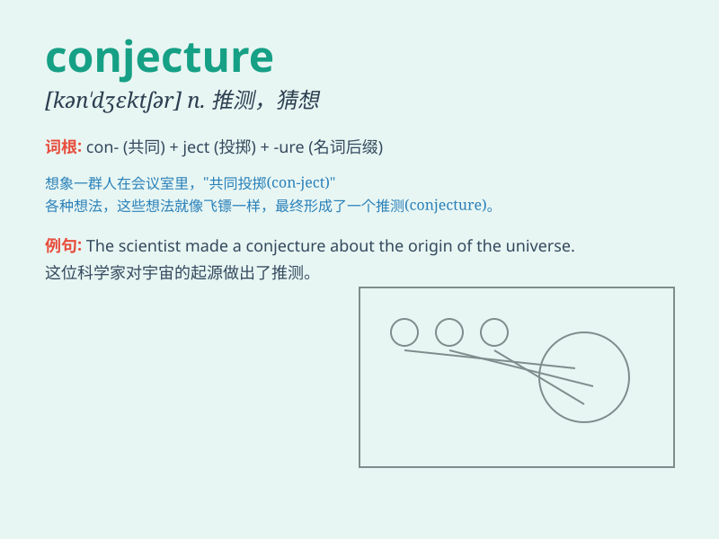

## conjecture

**英音:** _[kən\'dʒektʃə]_ **美音:** _[kən\'dʒɛktʃɚ]_

**译义:** *n.v.推测,臆说,猜想*

### 短语

+ **conjecture about:** _对\...\...进行猜测_

+ **groundless conjecture:** _无根据的猜测_

+ **mere conjecture:** _纯粹的猜测_

+ **wild conjecture:** _胡乱猜测_

+ **speculative conjecture:** _推测性的猜测_

### 例句

#### 例句1

> **His conjecture about the cause of the accident was based on
limited evidence.**

**中文翻译:** 他对事故原因的推测是基于有限的证据。

**单词释义:** 推测；猜测

#### 例句2

> **It\'s pure conjecture that she will win the competition.**

**中文翻译:** 她会赢得比赛纯粹是猜测。

**单词释义:** 猜测；臆测

#### 例句3

> **Scientists are cautious about making conjectures without solid
data.**

**中文翻译:** 科学家们在没有可靠数据的情况下做出猜想持谨慎态度。

**单词释义:** 推测；猜想

### 背诵小故事

> A detective was trying to solve a mystery. He made a conjecture that
the thief entered through the window. But it was just a guess based on
some clues. Later, it turned out his conjecture was wrong.

**一位侦探试图解开一个谜团。他猜想小偷是从窗户进入的。但这只是基于一些线索的猜测。后来，事实证明他的推测是错误的。**

### 图义

