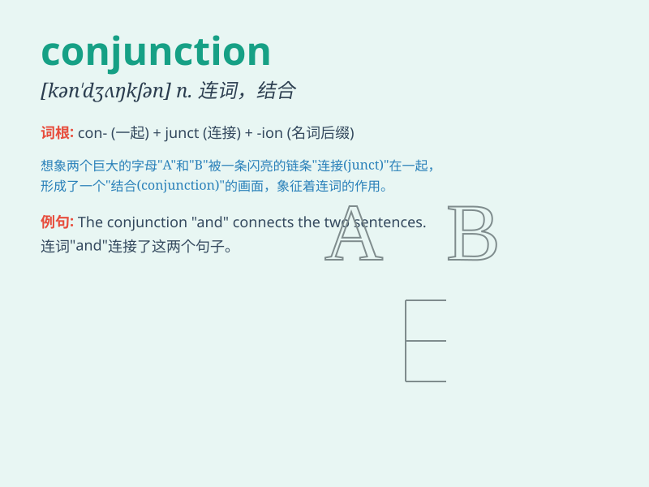

## conjunction

**英音:** _[kən\'dʒʌŋ(k)ʃ(ə)n]_ **美音:**
_[kən\'dʒʌŋkʃən]_

**译义:** *n.联合,关联,连接词*

### 短语

+ **in conjunction with:** _与......共同；连同_

+ **conjunction fallacy:** _合取谬误_

+ **logical conjunction:** _逻辑合取_

+ **coordinating conjunction:** _并列连词_

+ **subordinating conjunction:** _从属连词_

### 例句

#### 例句1

> **The conjunction \'and\' is used to connect words and phrases.**

**中文翻译:** 连词"and"用于连接单词和短语。

**单词释义:** 连词

#### 例句2

> **In the sentence \'I like apples but not oranges\', \'but\' is a
conjunction.**

**中文翻译:** 在"我喜欢苹果但不喜欢橙子"这句话中，"但是"是一个连词。

**单词释义:** 连词

#### 例句3

> **The conjunction \'or\' indicates a choice between two or more
possibilities.**

**中文翻译:** 连接词"或"表示在两种或多种可能性之间进行选择。

**单词释义:** 连词

### 背诵小故事

> A little rabbit was lost in a forest. It needed to find the right
conjunction of paths to get home. Finally, it chose the conjunction that
led to its cozy burrow.

**一只小兔子在森林里迷路了。它需要找到正确的道路交汇点才能回家。最后，它选择了通向它舒适洞穴的交汇点。**

### 图义

