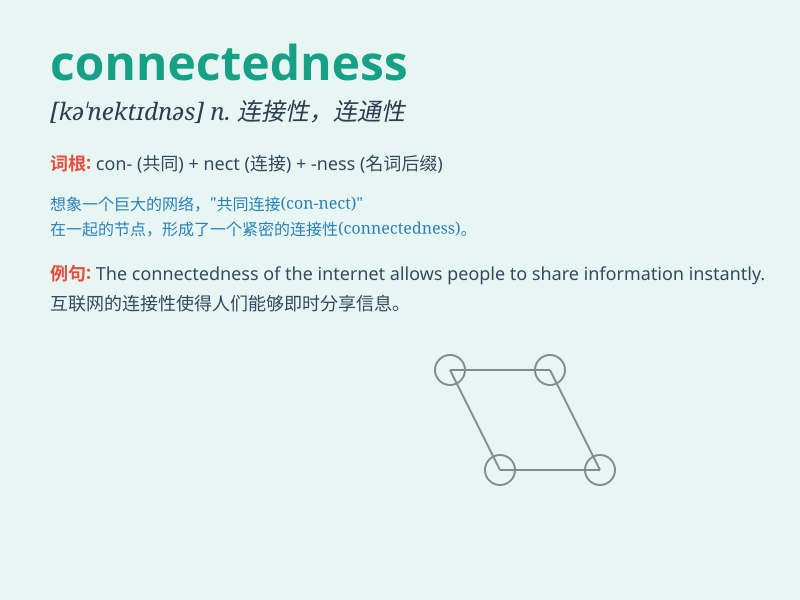

## connectedness

**英音:** _[kəˈnektɪdnəs]_ **美音:** _[kəˈnektɪdnəs]_

**译义:** *连通性*

### 短语

+ **sense of connectedness:** _连接感；关联感_

+ **emotional connectedness:** _情感联系_

+ **social connectedness:** _社会联系；社会关联性_

+ **interpersonal connectedness:** _人际联系_

+ **global connectedness:** _全球联系；全球关联性_

### 例句

#### 例句1

> **The connectedness of the global economy has brought both
opportunities and challenges.**

**中文翻译:** 全球经济的互联互通既带来了机遇，也带来了挑战。

**单词释义:** 连通性；连接状态

#### 例句2

> **She felt a sense of connectedness with her family during the
holiday.**

**中文翻译:** 假期期间，她感受到与家人的联系。

**单词释义:** 亲密联系；关联

#### 例句3

> **The study focuses on the connectedness between mental health and
social environment.**

**中文翻译:** 该研究的重点是心理健康与社会环境之间的联系。

**单词释义:** 关联性

### 背诵小故事

> In a small village, people felt a strong connectedness. They shared
joys and sorrows. When a flood came, they helped each other, showing
that connectedness can overcome difficulties. This is the meaning of
\'connectedness\'.

**在一个小村庄里，人们感受到了强烈的连通性。他们同甘共苦。当洪水来临时，他们互相帮助，这展现了连通性的意义。**

### 图义

