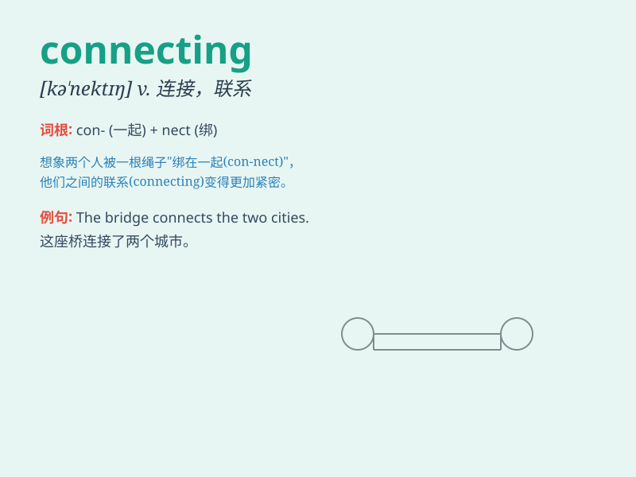

## connecting

**英音:** _[kə\'nektɪŋ]_ **美音:** _[kə\'nektɪŋ]_

**译义:** *v.连接, 联络, 结合, 联系, 联通*

### 短语

+ **connecting rod:** _连杆_

+ **connecting flight:** _中转航班_

+ **connecting wire:** _连接线；导线_

+ **connecting room:** _连通房_

+ **connecting link:** _连接环节；连接件_

### 例句

#### 例句1

> **The train is connecting two major cities.**

**中文翻译:** 这列火车正在连接两个主要城市。

**单词释义:** 连接

#### 例句2

> **Connecting the dots helps us understand the big picture.**

**中文翻译:** 把这些点连接起来有助于我们理解大局。

**单词释义:** 连接；联系

#### 例句3

> **She is good at connecting people and building relationships.**

**中文翻译:** 她善于把人们联系起来并建立关系。

**单词释义:** 使联系；使关联

### 背诵小故事

> One day, I was lost in a strange city. But I found a connecting path
that led me to a friendly local. With their help, I finally reached my
destination. The path was like a bridge, connecting me to the right
place.

**有一天，我在一个陌生的城市迷路了。但我发现了一条连接的小路，它把我引向了一位友好的当地人。在他们的帮助下，我最终到达了目的地。这条小路就像一座桥梁，把我连接到了正确的地方。**

### 图义

