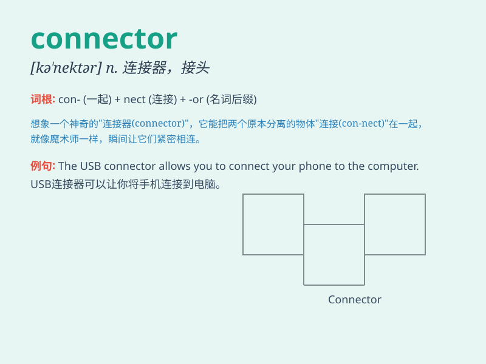

## connector

**英音:** _[kə\'nektə(r)]_ **美音:** _[kə\'nɛktɚ]_

**译义:** *n.连接器*

### 短语

+ **electrical connector:** _电连接器_

+ **data connector:** _数据连接器_

+ **pipe connector:** _管接头_

+ **cable connector:** _电缆连接器_

+ **connector plug:** _连接器插头_

### 例句

#### 例句1

> **The connector between the two pipes is loose.**

**中文翻译:** 两根管子之间的接头松动。

**单词释义:** 连接器

#### 例句2

> **He is a key connector in the supply chain.**

**中文翻译:** 他是供应链中的关键连接者。

**单词释义:** 联络人

#### 例句3

> **The connector of this computer cable is damaged.**

**中文翻译:** 该计算机电缆的连接器已损坏。

**单词释义:** 接头

### 背诵小故事

>
想象一下，在一个充满电线和电路的房间里，有个小机器人叫康尼。康尼的工作就是连接各种线路，确保电流顺利通过，它就是\'connector\'（连接器），专门负责把不同部分连接起来。

**想象在一个充满电线的房间里，有个叫康尼的小机器人，其工作是连接线路，它就是连接器，负责连接不同部分。**

### 图义

