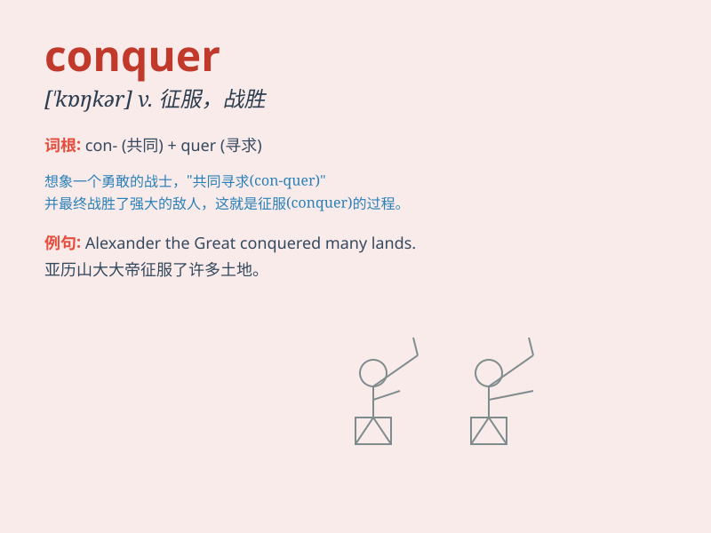

## conquer

**英音:** _[\'kɒŋkə]_ **美音:** _[\'kɑŋkɚ]_

**译义:** *vt.征服,战胜,占领,克服(困难等),破(坏习惯等)*

### 短语

+ **conquer fear:** _克服恐惧_

+ **conquer difficulties:** _战胜困难_

+ **conquer territory:** _征服领土_

+ **conquer nature:** _征服自然_

+ **conquer one\'s addiction:** _克服某人的瘾_

### 例句

#### 例句1

> **The army managed to conquer the enemy\'s stronghold.**

**中文翻译:** 这支军队成功征服了敌人的据点。

**单词释义:** 征服

#### 例句2

> **She has conquered her fear of heights.**

**中文翻译:** 她已经克服了恐高的毛病。

**单词释义:** 克服

#### 例句3

> **He set out to conquer the world of business.**

**中文翻译:** 他开始去征服商业世界。

**单词释义:** 征服

### 背诵小故事

> A brave knight set out on a journey to conquer the evil dragon that
terrorized the land. After a fierce battle, he finally defeated the
dragon and brought peace. Remember, \'conquer\' means to defeat and take
control.

**一位勇敢的骑士踏上征程去征服恐吓这片土地的恶龙。经过一场激烈的战斗，他最终打败了恶龙，带来了和平。记住，\'conquer\'意思是战胜并掌控。**

### 图义

