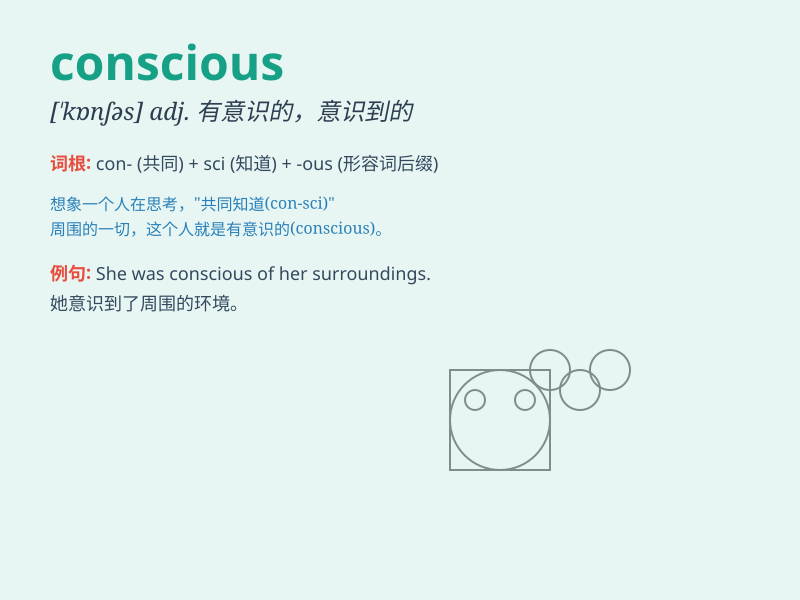

## conscious

**英音:** _[ˈkɒnʃəs]_ **美音:** _[ˈkɑnʃəs]_

**译义:** *adj. 意识到的, 有意识的, 神志清醒的*

### 短语

+ **conscious of:** _意识到；知道_

+ **be conscious:** _有意识；清醒_

+ **conscious decision:** _有意识的决定_

+ **conscious effort:** _刻意的努力_

+ **conscious mind:** _意识；显意识_

### 例句

#### 例句1

> **I was conscious of someone watching me.**

**中文翻译:** 我意识到有人在看着我。

**单词释义:** 意识到

#### 例句2

> **She\'s very conscious of her appearance.**

**中文翻译:** 她非常注重自己的外表。

**单词释义:** 注重

#### 例句3

> **He remained conscious throughout the operation.**

**中文翻译:** 在整个手术过程中他一直是清醒的。

**单词释义:** 清醒的

### 背诵小故事

> One day, when Tom was crossing the road, he was very conscious of the
speeding cars. He looked left and right carefully and safely crossed.
Being conscious means being aware and alert.

**一天，当汤姆过马路时，他非常留意那些疾驰的汽车。他仔细地左右看，然后安全地穿过了马路。conscious
这个词意味着有知觉的，意识到的，警觉的。**

### 图义

