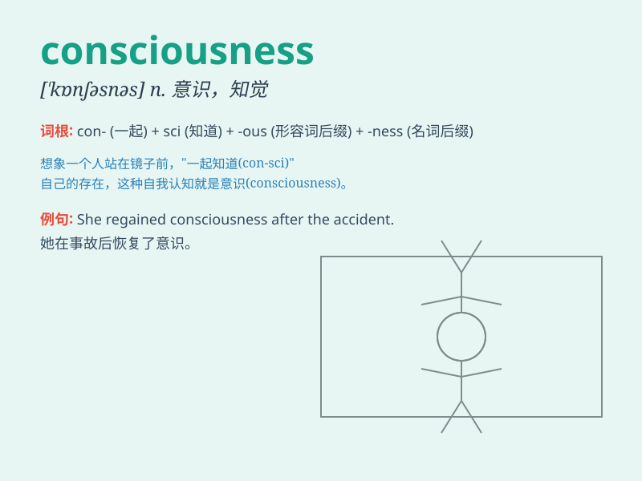

## consciousness

**英音:** _[\'kɒnʃəsnɪs]_ **美音:** _[\'kɑnʃəsnəs]_

**译义:** *n.意识,知觉,自觉,觉悟,个人思想*

### 短语

+ **social consciousness:** _社会意识_

+ **public consciousness:** _公共意识_

+ **class consciousness:** _阶级意识_

+ **environmental consciousness:** _环境意识_

+ **collective consciousness:** _集体意识_

### 例句

#### 例句1

> **He lost consciousness after the accident.**

**中文翻译:** 事故发生后，他失去了意识。

**单词释义:** 意识

#### 例句2

> **Her consciousness of the importance of the issue grew over
time.**

**中文翻译:** 随着时间的推移，她对这个问题重要性的认识增强了。

**单词释义:** 认识；觉悟

#### 例句3

> **The drug affected his consciousness and made him drowsy.**

**中文翻译:** 这种药物影响了他的意识，使他昏昏欲睡。

**单词释义:** 意识

### 背诵小故事

> One day, a sleepy person was in a daze. Suddenly, a bright light woke
them up and made them regain their consciousness. They became fully
aware of their surroundings and could think clearly again.

**有一天，一个困倦的人正在发呆。突然，一道亮光把他们唤醒，让他们恢复了意识。他们完全清楚了周围的情况，又能清晰地思考了。**

### 图义

