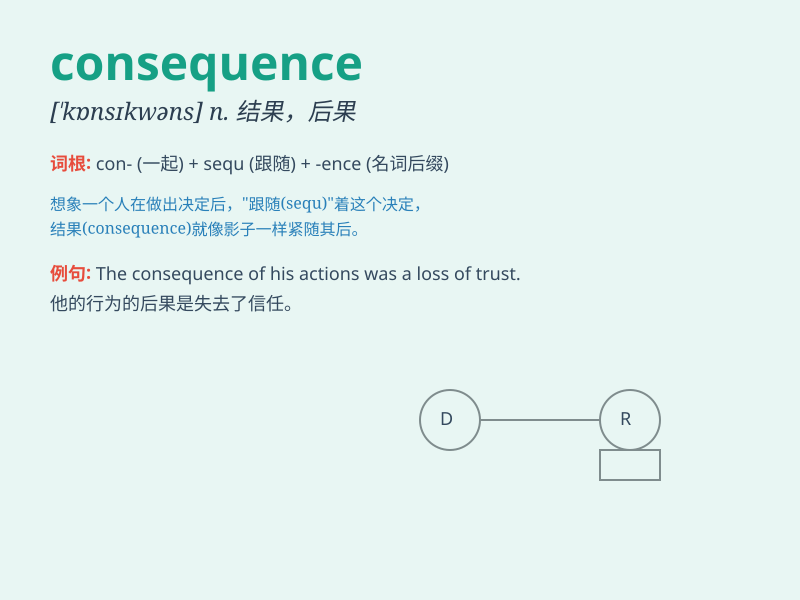

## consequence

**英音:** _[\'kɒnsɪkw(ə)ns]_ **美音:** _[\'kɑnsəkwɛns]_

**译义:** *n.结果,[逻]推理,推论,因果关系,重要的地位*

### 短语

+ **in consequence:** _因此；结果_

+ **as a consequence:** _结果；因此_

+ **consequence of:** _\...的后果_

+ **take the consequences:** _承担后果_

+ **face the consequences:** _面对后果_

### 例句

#### 例句1

> **The consequence of his actions was a loss of trust from his
friends.**

**中文翻译:** 他的行为的后果是失去了朋友们的信任。

**单词释义:** 后果；结果

#### 例句2

> **You have to face the consequence of your decision.**

**中文翻译:** 你必须面对你决定的后果。

**单词释义:** 后果

#### 例句3

> **As a consequence of the bad weather, the flight was delayed.**

**中文翻译:** 由于恶劣天气，航班延误了。

**单词释义:** 由于\...\...的结果

### 背诵小故事

> Once, a boy made a wrong choice and didn\'t listen to his parents. As
a consequence, he failed the exam. This made him realize that every
decision has its result.

**曾经，一个男孩做了错误的选择且不听父母的话。结果，他考试不及格。这让他意识到每一个决定都有其后果。**

### 图义

