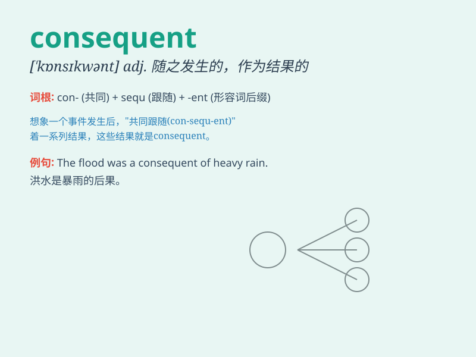

## consequent

**英音:** _[\'kɒnsɪkw(ə)nt]_ **美音:** _[\'kɑnsəkwənt]_

**译义:** *adj.作为结果的,随之发生的*

### 短语

+ **consequent upon:** _由于；因为_

+ **consequent clause:** _结果从句_

+ **consequent event:** _随之发生的事件_

+ **consequent flow:** _顺向水流_

+ **consequent action:** _后续行动_

### 例句

#### 例句1

> **The flood was a consequent of the heavy rain.**

**中文翻译:** 洪水是大雨的后果。

**单词释义:** 作为结果的；随之发生的

#### 例句2

> **His failure was consequent upon his laziness.**

**中文翻译:** 他的失败是由于他的懒惰。

**单词释义:** 因\...而引起的；由\...导致的

#### 例句3

> **The consequent damage was extensive.**

**中文翻译:** 随之而来的破坏是广泛的。

**单词释义:** 随之发生的；作为结果的

### 背诵小故事

> 有一次探险，小明走了一条不同寻常的路，consequent
地，他迷路了。后来大家都说，这是他错误选择带来的必然结果。记住这个，就能记住
consequent 是'随之发生的；作为结果的'意思啦。

**有一次探险，小明走了一条不同寻常的路，随之发生地，他迷路了。后来大家都说，这是他错误选择带来的必然结果。记住这个，就能记住
consequent 是'随之发生的；作为结果的'意思啦。**

### 图义

