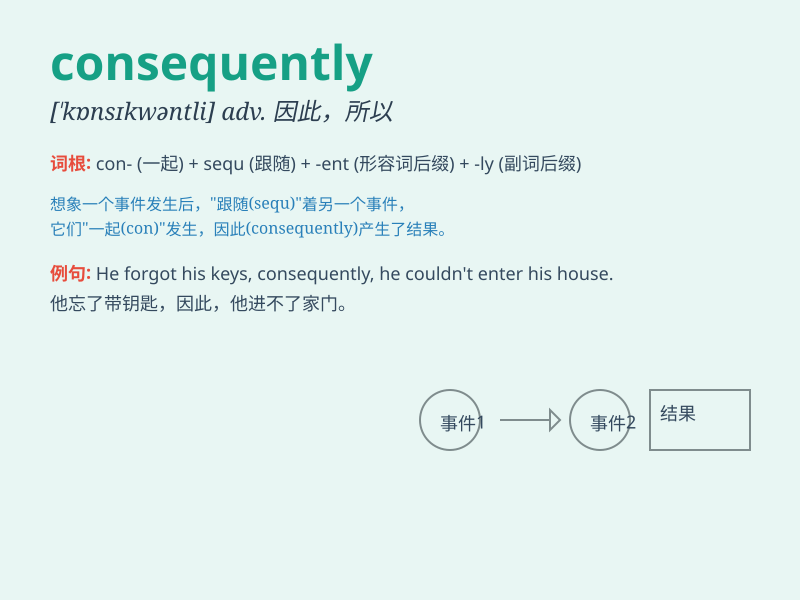

## consequently

**英音:** _[\'kɒnsɪkw(ə)ntlɪ]_ **美音:**
_[\'kɑnsəkwɛntli]_

**译义:** *adv.从而,因此*

### 短语

+ **consequently therefore:** _因此；所以_

+ **consequently as a result:** _结果；因而_

+ **consequently thus:** _从而；于是_

+ **consequently accordingly:** _相应地；所以_

+ **consequently in consequence:** _结果；后果_

### 例句

#### 例句1

> **The weather was bad; consequently, the flight was delayed.**

**中文翻译:** 天气不好；因此，航班延误了。

**单词释义:** 因此，所以

#### 例句2

> **He spent all his money on gambling; consequently, he ended up in
debt.**

**中文翻译:** 他把所有的钱都花在了赌博上；结果，他负债累累。

**单词释义:** 结果

#### 例句3

> **She didn\'t study hard; consequently, she failed the exam.**

**中文翻译:** 她学习不努力；所以，她考试不及格。

**单词释义:** 所以

### 背诵小故事

> A student was always late for class. Consequently, he missed many
important lessons and failed the exam. This shows that \'consequently\'
means as a result or therefore.

**一个学生总是上课迟到。结果，他错过了很多重要的课程并且考试不及格。这表明'consequently'意思是结果、因此。**

### 图义

