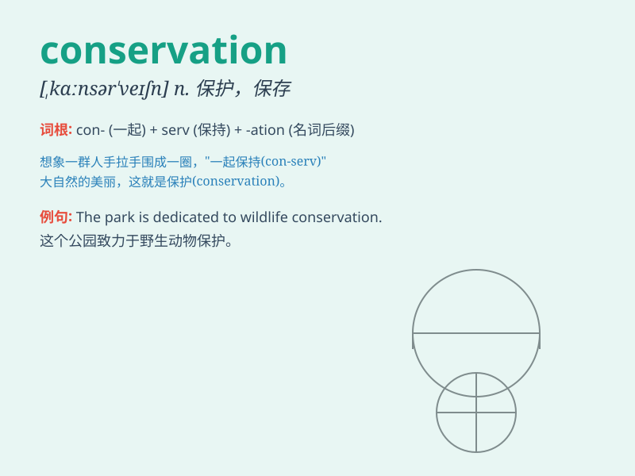

## conservation

**英音:** _[kɒnsə\'veɪʃ(ə)n]_ **美音:**
_[,kɑnsɚ\'veʃən]_

**译义:** *n.保存,保持,守恒*

### 短语

+ **conservation area:** _保护区_

+ **energy conservation:** _能源节约_

+ **wildlife conservation:** _野生动物保护_

+ **conservation measures:** _保护措施_

+ **conservation of resources:** _资源保护_

### 例句

#### 例句1

> **The conservation of natural resources is of vital importance for
the future of our planet.**

**中文翻译:** 自然资源的保护对于我们星球的未来至关重要。

**单词释义:** 保护；保存

#### 例句2

> **She is involved in the conservation of historical buildings.**

**中文翻译:** 她参与了历史建筑的保护工作。

**单词释义:** 保护；保存

#### 例句3

> **Wildlife conservation is a global concern.**

**中文翻译:** 野生动物保护是全球关注的问题。

**单词释义:** 保护

### 背诵小故事

> A group of kids went to a forest. They saw many beautiful trees and
decided to protect them. This act of protecting is called conservation.
They want to keep the forest nice for a long time.

**一群孩子去了森林。他们看到许多漂亮的树木并决定保护它们。这种保护的行为就叫保护。他们想让森林一直保持美好。**

### 图义

