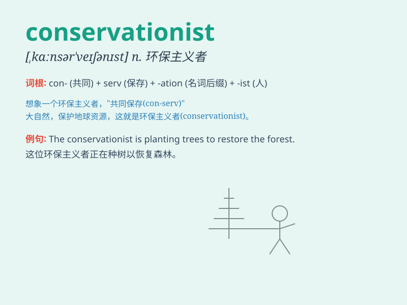

## conservationist

**英音:** _[kɒnsə\'veɪʃ(ə)nɪst]_ **美音:**
_[,kɑnsɚ\'veʃənɪst]_

**译义:** *n.(天然资源的)保护管理论者*

### 短语

+ **wildlife conservationist:** _野生动物保护主义者_

+ **environmental conservationist:** _环境保育人士_

+ **marine conservationist:** _海洋保护主义者_

+ **forest conservationist:** _森林保护主义者_

+ **conservationist movement:** _保护主义运动_

### 例句

#### 例句1

> **The conservationist is working hard to protect the endangered
species.**

**中文翻译:** 这位自然环境保护主义者正在努力保护濒危物种。

**单词释义:** 自然环境保护主义者

#### 例句2

> **She became a well-known conservationist for her efforts in forest
preservation.**

**中文翻译:**
由于她在森林保护方面的努力，她成为了一位著名的自然环境保护主义者。

**单词释义:** 自然环境保护主义者

#### 例句3

> **The conservationist led a campaign to stop illegal logging.**

**中文翻译:** 这位自然环境保护主义者领导了一场阻止非法伐木的运动。

**单词释义:** 自然环境保护主义者

### 背诵小故事

> A conservationist named Lily was passionate about protecting nature.
She spent her days planting trees and saving endangered animals. Her
efforts showed that a conservationist is someone who works hard to
preserve our environment.

**一位名叫莉莉的自然环境保护主义者热衷于保护自然。她每天都在种树和拯救濒危动物。她的努力表明，自然环境保护主义者就是努力保护我们环境的人。**

### 图义

