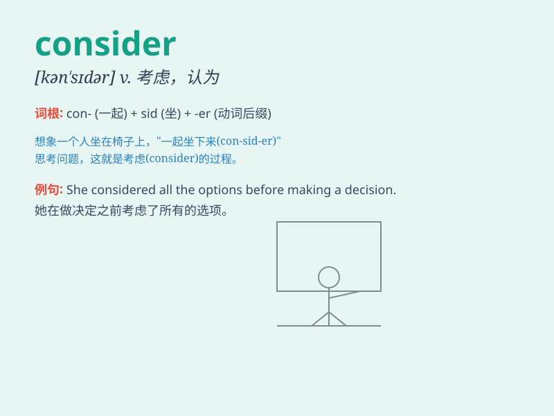

## consider

**英音:** _[kən\'sɪdə]_ **美音:** _[kən\'sɪdɚ]_

**译义:** *vt.考虑,照顾,认为*

### 短语

+ **consider doing sth:** _考虑做某事_

+ **consider sb/sth (as) sth:** _认为某人/某物是某物_

+ **consider that:** _认为；考虑到_

+ **all things considered:** _从各方面考虑；通盘考虑_

+ **take sth into consideration:** _把某事考虑在内_

### 例句

#### 例句1

> **You should consider my suggestion carefully.**

**中文翻译:** 你应该仔细考虑我的建议。

**单词释义:** 考虑

#### 例句2

> **I am considering changing my job.**

**中文翻译:** 我正在考虑换工作。

**单词释义:** 考虑

#### 例句3

> **We consider him to be a reliable person.**

**中文翻译:** 我们认为他是一个可靠的人。

**单词释义:** 认为

### 背诵小故事

> One day, I was standing in front of a beautiful painting. I spent a
long time looking at it and thinking. I was considering whether to buy
it. Finally, I decided it was worth having. That\'s how I understood
\'consider\' - to think carefully about something.

**有一天，我站在一幅漂亮的画前。我花了很长时间看它并思考。我在考虑是否要买它。最后，我认定它值得拥有。这就是我对'consider'（仔细考虑）的理解。**

### 图义

