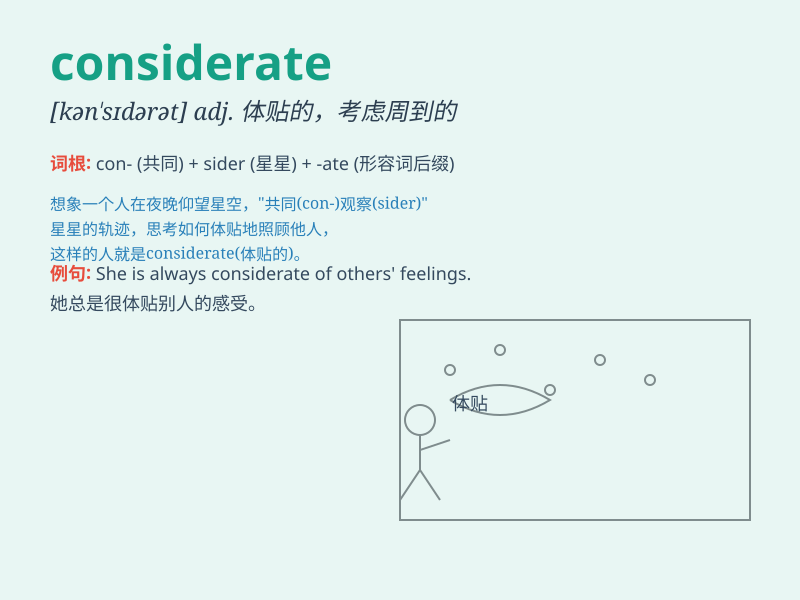

## considerate

**英音:** _[kən\'sɪd(ə)rət]_ **美音:** _[kənˈsɪdərɪt]_

**译义:** *adj.考虑周到的*

### 短语

+ **be considerate of:** _体谅；考虑到_

+ **considerate towards:** _对\...\...体贴_

+ **considerate behavior:** _体贴的行为_

+ **considerate attitude:** _体贴的态度_

+ **considerate gesture:** _体贴的举动_

### 例句

#### 例句1

> **He is always considerate of others\' feelings.**

**中文翻译:** 他总是体谅他人的感受。

**单词释义:** 体贴的；考虑周到的

#### 例句2

> **It was very considerate of you to help me with my luggage.**

**中文翻译:** 你帮我拿行李，真是太体贴了。

**单词释义:** 体贴的；考虑周到的

#### 例句3

> **A considerate friend will listen patiently when you have
problems.**

**中文翻译:** 一个体贴的朋友在你有问题时会耐心倾听。

**单词释义:** 体贴的；考虑周到的

### 背诵小故事

> One day, Tom was sick and his friend Jack not only sent him medicine
but also cooked for him. Jack was so considerate. He always thought
about others\' needs and feelings.

**有一天，汤姆生病了，他的朋友杰克不仅给他送药，还为他做饭。杰克非常体贴。他总是考虑别人的需要和感受。**

### 图义

