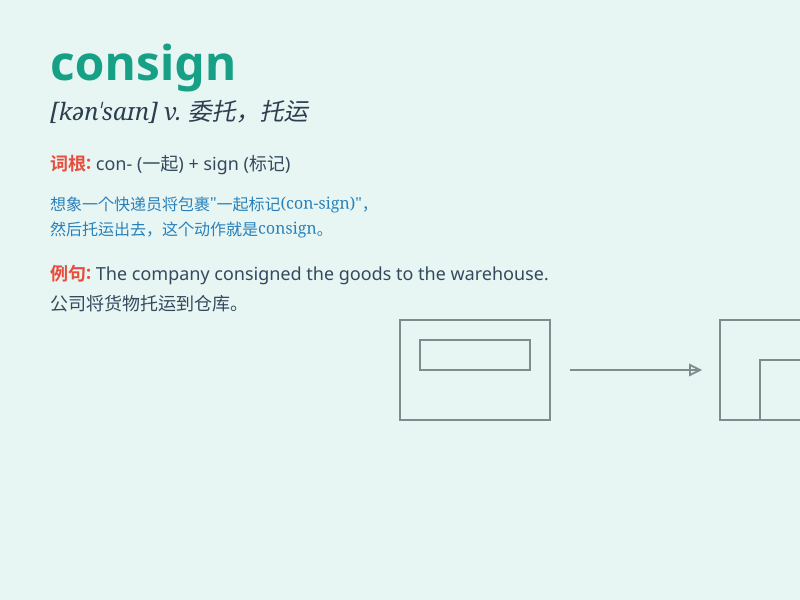

## consign

**英音:** _[kən\'saɪn]_ **美音:** _[kən\'saɪn]_

**译义:** *vt.托运,委托*

### 短语

+ **consign to:** _交付；把......置于_

+ **consign something to oblivion:** _把某物遗忘；使某物被忘却_

+ **consign goods:** _托运货物_

+ **consign for shipment:** _交付装船_

+ **consign someone to prison:** _把某人送进监狱_

### 例句

#### 例句1

> **We consigned the goods to you by express delivery.**

**中文翻译:** 我们通过快递把货物寄给了你。

**单词释义:** 交付；托运

#### 例句2

> **The artist consigned his paintings to the gallery for sale.**

**中文翻译:** 这位艺术家把他的画交给画廊出售。

**单词释义:** 把\...交付给

#### 例句3

> **She consigned her old furniture to the attic.**

**中文翻译:** 她把旧家具存放在阁楼里。

**单词释义:** 把\...置于；把\...交付给

### 背诵小故事

> A merchant consigned a batch of precious jewels to a trusted courier
for delivery to a distant customer. The act of consigning means to
entrust or hand over something for shipment or safekeeping.

**一位商人把一批珍贵的珠宝托付给一位可靠的快递员，让其运送给远方的一位顾客。consign
这个词的意思是委托或交付某物以便运输或保管。**

### 图义

