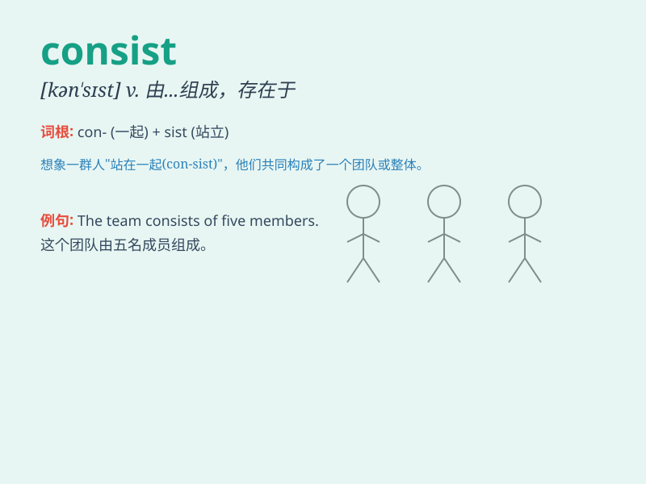

## consist

**英音:** _[kən\'sɪst]_ **美音:** _[kən\'sɪst]_

**译义:** *vi.由\...组成,在于,一致*

### 短语

+ **consist of:** _由......组成；由......构成_

+ **consist in:** _在于；存在于_

+ **consist with:** _与......一致；符合_

+ **be consisted of:** _被由......组成_

+ **consist mainly of:** _主要由......组成_

### 例句

#### 例句1

> **The team consists of five members.**

**中文翻译:** 这个团队由五名成员组成。

**单词释义:** 由......组成

#### 例句2

> **Happiness consists in contentment.**

**中文翻译:** 幸福在于知足。

**单词释义:** 在于

#### 例句3

> **The salad consists mainly of tomatoes and cucumbers.**

**中文翻译:** 这份沙拉主要由西红柿和黄瓜组成。

**单词释义:** 主要由......组成

### 背诵小故事

> A team consists of various members. There is a football team. It
consists of a goalkeeper, defenders, midfielders and strikers. They work
together to win. Remember, \'consist\' means be made up of.

**一个团队由各种各样的成员组成。有一支足球队。它由守门员、后卫、中场和前锋组成。他们共同努力去获胜。记住，\'consist\'
意思是由\...\...组成。**

### 图义

